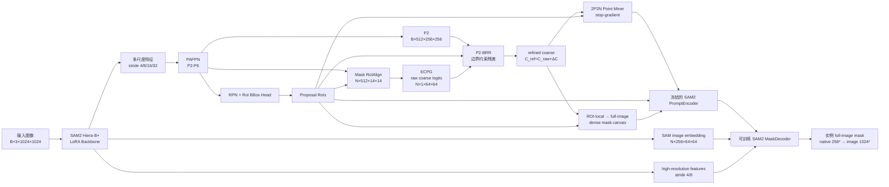
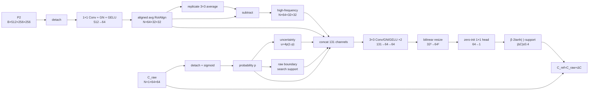
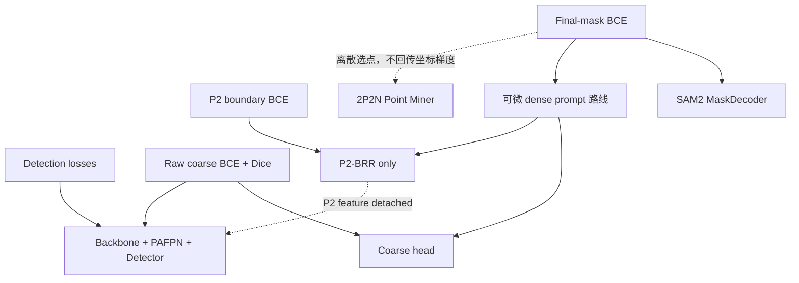

# C5-v2 完整设计：架构、数据流与论文制图说明

本文档整理 C5-v2 当前代码已经实现的模型架构、张量数据流、训练监督、梯度边界和
推理路径，供后续绘制论文方法图、撰写 Method 章节和设计消融实验使用。

> 状态说明：C5-v2 当前仍是待消融验证的实验方案。本文描述的是已经落地的设计与
> 实现契约，不将尚未获得实验支持的设计动机表述为已证明的性能结论。

## 1. 方法定位

C5-v2 的核心路线是：

> 从 proposal 对齐的 RoI 特征显式预测实例粗形状，利用 P2 高频特征对粗掩码边界
> 进行受约束的局部残差修正，再把修正后的粗掩码统一转化为 SAM2 可消费的点、框和
> dense mask prompt。

建议在论文中将两个主要设计模块命名为：

1. **显式粗掩码到提示生成器**（Explicit Coarse-to-Prompt Generator，ECPG）；
2. **P2 边界约束残差修正器**（P2 Boundary-constrained Residual Refiner，P2-BRR）。

PAFPN 是 C5-v2 的多尺度检测与 RoI 特征基础，但不作为上述两个核心设计模块之一。
旧 DenseBR 已从当前主线删除；P2-BRR 的定位、输入、监督和梯度边界均与旧 DenseBR
不同。

## 2. C5-v2 固定实验契约

C5-v2 wrapper 固定以下结构：

| 配置项 | C5-v2 取值 |
|---|---|
| 输入尺寸 | `1024×1024` |
| Backbone | SAM2 Hiera Base+ + LoRA |
| Neck | PAFPN |
| Prompt 路线 | explicit coarse |
| Prompt 组合 | points + box + dense |
| Coarse fusion | `roi_only`，FiLM 默认关闭 |
| P2-BRR | 开启 |
| SAM image embedding stride | `16` |
| SAM image embedding | `256×64×64` |
| PromptEncoder | 从 SAM2 权重严格加载并冻结 |
| MaskDecoder | 从 SAM2 权重加载并参与训练 |
| Final-mask 坐标系 | full-image |
| 训练点筛默认数据 | 20% train / 100% validation |
| EMA | 点筛默认关闭 |

严格对照 R1-C4 与 C5-v2 的其余设置相同，仅关闭 P2-BRR。因此：

\[
\text{C5-v2} = \text{R1-C4} + \text{P2-BRR}.
\]

## 3. 总体架构与完整数据流



总体前向过程可写为：

\[
I \rightarrow \mathcal F \rightarrow \mathcal P \rightarrow \mathcal R
\rightarrow C^{raw} \rightarrow C^{ref}
\rightarrow \{Q, B, D\}
\rightarrow \hat M,
\]

其中：

- \(\mathcal F\)：SAM2 backbone 多尺度特征；
- \(\mathcal P\)：PAFPN 输出；
- \(\mathcal R\)：检测器 proposal RoIs；
- \(C^{raw}\)：原始 ROI-local coarse logits；
- \(C^{ref}\)：P2-BRR 修正后的 coarse logits；
- \(Q,B,D\)：点、框和 dense prompt；
- \(\hat M\)：SAM2 MaskDecoder 输出的实例掩码。

## 4. 关键张量尺寸

| 名称 | 形状 | 说明 |
|---|---|---|
| 输入图像 | `B×3×1024×1024` | WHU-1024 输入 |
| Backbone stride-4 | `B×256×256×256` | SAM2 第一级输出 |
| Backbone stride-8 | `B×256×128×128` | SAM2 第二级输出 |
| Backbone stride-16 | `B×256×64×64` | SAM image embedding 来源 |
| Backbone stride-32 | `B×256×32×32` | SAM2 第四级输出 |
| PAFPN P2-P6 | `B×512×{256,128,64,32,16}²` | Detector 接口 |
| Mask RoI feature | `N×512×14×14` | proposal 对齐的 coarse 输入 |
| Raw/refined coarse | `N×1×64×64` | ROI-local logits |
| P2-BRR RoI feature | `N×64×32×32` | P2 投影并 RoIAlign 后 |
| Point coordinates | `N×4×2` | 顺序为 P1、P2、N1、N2 |
| Sparse prompt | `N×6×256` | 4 point tokens + 2 box-corner tokens |
| PromptEncoder mask input | `N×1×256×256` | 官方 stride-16 路线 |
| Dense prompt embedding | `N×256×64×64` | 送入 MaskDecoder |
| Image embedding | `N×256×64×64` | 按每图 RoI 数重复 |
| Native final mask | `N×1×256×256` | SAM2 decoder 原生输出 |
| Evaluation mask | `N×1×1024×1024` | 单次 resize 到整图 |

这里的 \(B\) 是图像 batch size，\(N\) 是当前 batch 内正 proposal 的总数。

## 5. Backbone 与 PAFPN

SAM2 Hiera Base+ 对 1024 输入产生四个 256 通道特征：

\[
F_s\in\mathbb R^{B\times256\times(1024/s)\times(1024/s)},
\quad s\in\{4,8,16,32\}.
\]

PAFPN 的内部宽度为 256，流程为：

1. 各层经过 `1×1` lateral projection；
2. 自顶向下 FPN 融合高层语义；
3. 自底向上 PAN 融合低层定位信息；
4. 从最低分辨率输出继续下采样得到 stride-64 层；
5. 每层通过 `1×1` projection 升到 detector 所需的 512 通道；
6. 每层输出乘以独立的可学习 level scale。

PAFPN 输出同时服务于 RPN、bbox head、Mask RoIAlign 和 P2-BRR。SAM2 MaskDecoder
使用的 stride-16 image embedding 与 detector neck 的输出选择彼此解耦。

## 6. 模块一：显式粗掩码到提示生成器 ECPG

### 6.1 模块职责

ECPG 用一个可监督、可解释的实例形状中间表示替代直接从 RoI 特征生成隐式 MLP
token 的路线：

\[
\text{RoI feature}
\rightarrow \text{explicit coarse mask}
\rightarrow \text{points + box + dense prompt}.
\]

其目标是让三类 prompt 共享同一实例形状语义来源：

- point prompt 提供离散前景/背景位置约束；
- box prompt 提供实例位置和范围锚点；
- dense prompt 提供连续形状先验。

### 6.2 原始 coarse mask 预测

对于第 \(i\) 个 proposal \(r_i\)，使用同一个 proposal 提取 Mask RoI feature：

\[
F_i^{roi}=\operatorname{RoIAlign}(\mathcal P,r_i)
\in\mathbb R^{512\times14\times14}.
\]

当前默认 `roi_only`，因此 RoI feature 直接进入 SmallMaskDecoder：

\[
C_i^{raw}=D_c(F_i^{roi})\in\mathbb R^{1\times64\times64}.
\]

SmallMaskDecoder 的实际结构为：

```text
512×14×14
→ 3×3 Conv 512→128 + GN + GELU
→ 3×3 Conv 128→128 + GN + GELU
→ bilinear upsample ×2
→ 3×3 Conv 128→128 + GN + GELU
→ bilinear upsample ×2
→ 3×3 Conv 128→64 + GN + GELU
→ 3×3 Conv 64→1
→ 必要时 resize 到 64×64
```

`roi_only` 模式不构造和不计算：

- 全图 context tokens；
- RoI box encoding；
- cross-attention；
- FiLM gamma/beta heads；
- context gate。

FiLM 只保留为后续显式消融，不属于 C5-v2 默认设计。

### 6.3 Raw coarse 的独立监督

使用同一 prompt proposal 从 GT 实例掩码裁剪 ROI-local target，再用 nearest
interpolation 调整到 \(64\times64\)：

\[
Y_i^{roi}=\operatorname{Resize}_{nearest}
(\operatorname{Crop}(Y_i,r_i)).
\]

raw coarse 损失为：

\[
\mathcal L_{coarse}
=0.10\left[
\mathcal L_{BCE}(C^{raw},Y^{roi})
+\mathcal L_{Dice}(C^{raw},Y^{roi})
\right].
\]

该损失只以 \(C^{raw}\) 为预测输入，不以 \(C^{ref}\) 替代它。这样可以保持 coarse
head 的整体实例语义学习目标稳定，P2-BRR 只承担局部边界修正。

### 6.4 2P2N 点挖掘

P2-BRR 输出 \(C^{ref}\) 后，从修正后的 coarse logits 挖掘点：

\[
Q_i=\operatorname{PointMiner}
(\operatorname{stopgrad}(C_i^{ref})).
\]

点顺序及当前策略为：

| 点 | 标签 | 选择原则 |
|---|---:|---|
| P1 | 1 | 高置信前景内部的平台中心；薄前景时回退到最佳内部点 |
| P2 | 1 | 与 P1 相距至少 `0.15×min(Hc,Wc)` 的第二前景点 |
| N1 | 0 | foreground 外环中的低置信背景；必要时回退到最佳背景点 |
| N2 | 0 | 膨胀前景之外的安全背景，并与 N1、P1 保持距离 |

主要阈值：

- foreground threshold：0.50；
- positive confidence：0.60；
- empty-mask positive fallback：0.35；
- negative confidence：0.30；
- normalized inside-distance：0.05；
- 正/负点最小距离比例：0.15。

无效点使用标签 `-1`；PromptEncoder 编码后对应 token 会显式置零。当整批不存在
有效 sparse modality 时，代码构造真正的空 sparse token 集，不注入学习到的
`not_a_point` token。point warm-up 默认关闭，从第一个 epoch 起使用完整 2P2N。

局部 coarse 坐标通过 proposal box 映射到 1024 图像坐标：

\[
x^{img}=x_1+\frac{x^{local}+0.5}{W_c}(x_2-x_1),
\]

\[
y^{img}=y_1+\frac{y^{local}+0.5}{H_c}(y_2-y_1).
\]

点挖掘是离散操作，因此 final-mask loss 不通过点坐标选择回传到 coarse logits。

### 6.5 Dense prompt 构造与门控注入

`points_box_dense` 路线把 \(C^{ref}\) 变换并粘贴到 full-image PromptEncoder canvas：

\[
\widetilde C_i=\operatorname{Paste}(T(C_i^{ref}),r_i)
\in\mathbb R^{1\times256\times256}.
\]

当前变换规则：

- 使用 raw logits；
- temperature 为 1.0；
- logits clamp 到 \([-8,8]\)；
- proposal 外填充 logit 0；
- dense 编码后的增量再次限制在 proposal 对应的 \(64\times64\) embedding support 内。

冻结的 SAM2 PromptEncoder 产生 shape dense embedding：

\[
D_i^{shape}=E_{mask}(\widetilde C_i)
\in\mathbb R^{256\times64\times64}.
\]

同时从同一 SAM2 checkpoint 严格加载并冻结 no-mask embedding：

\[
D^{base}\in\mathbb R^{256\times64\times64}.
\]

最终 dense prompt 为：

\[
D_i=D^{base}+\alpha\left(D_i^{shape}-D^{base}\right),
\qquad \alpha=\sigma(a).
\]

在计算 \(D_i^{shape}\) 后，proposal 外部先恢复为 \(D^{base}\)，因此实际增量只存在于
box support 内。当前 \(\alpha\) 初始化为 0.25，并被约束在 \((0,1)\)：

- \(\alpha\rightarrow0\)：退化为 SAM2 原始 no-mask embedding；
- \(\alpha\rightarrow1\)：主要采用显式 shape dense embedding；
- 中间值：在预训练 no-mask 基底与 coarse shape prompt 之间自适应插值。

训练日志记录 `alpha`、source/applied delta norm 和相对 base norm 的 ratio。
`alpha` 非零只说明门已打开，`applied_delta_ratio` 非零才说明 coarse prompt 实际改变了
送入 MaskDecoder 的 dense embedding。

### 6.6 PromptEncoder 输出

冻结 PromptEncoder 一次性编码 points、box 和 mask：

\[
S_i=E_{sparse}(Q_i,r_i)\in\mathbb R^{6\times256},
\]

\[
D_i\in\mathbb R^{256\times64\times64}.
\]

六个 sparse tokens 由 4 个 point tokens 和 2 个 box-corner tokens 构成。
PromptEncoder 参数冻结，但前向没有包裹 `torch.no_grad()`；因此 dense mask 编码路线
保留对 \(C^{ref}\) 的梯度。

## 7. 模块二：P2 边界约束残差修正器 P2-BRR

### 7.1 模块职责与区别

ECPG 负责预测完整的 ROI-local 实例主体、拓扑和整体形状。P2-BRR 不重新预测另一个
完整语义掩码，而是从高分辨率 P2 中读取边缘/纹理突变，只在 raw coarse 推导出的
边界搜索带内写入幅值受限的 residual：

| 模块 | 主要输入信息 | 负责内容 |
|---|---|---|
| ECPG | 512-channel Mask RoI semantic feature | 主体语义、拓扑、整体粗形状 |
| P2-BRR | detached P2 高频特征 + raw coarse cues | 局部边界定位与有界残差 |

### 7.2 模块结构



### 7.3 P2 高频特征提取

首先阻断 P2 到 detector/backbone 的梯度：

\[
\bar P_2=\operatorname{stopgrad}(P_2).
\]

投影并用与 prompt 完全相同的 `[batch_index,x1,y1,x2,y2]` RoIs 做 RoIAlign：

\[
Z_i=\operatorname{RoIAlign}
(\phi_{1\times1}(\bar P_2),r_i)
\in\mathbb R^{64\times32\times32}.
\]

局部低频和高频分量为：

\[
Z_i^{low}=\operatorname{Avg}_{3\times3}(Z_i),
\qquad
Z_i^{high}=Z_i-Z_i^{low}.
\]

P2 detach 使边界修正器只能读取检测特征，不能利用 boundary auxiliary 或 final-mask
梯度反向修改 PAFPN、RPN 和 bbox 分支。这样把边界增益与检测特征训练解耦。

### 7.4 Raw-only 边界搜索区域

所有 forward support 都由停止梯度的 raw coarse 产生：

\[
p_i=\sigma(\operatorname{stopgrad}(C_i^{raw})),
\]

\[
u_i=4p_i(1-p_i).
\]

其中 \(u_i\) 在 \(p_i=0.5\) 时最大，在确定前景或背景处趋近于 0。随后：

1. 对 \(p_i\) 使用 replicate-padding 的 `3×3` average；
2. 以 0.5 二值化；
3. 通过膨胀减腐蚀得到 morphological boundary core；
4. 半径 2 膨胀得到 raw boundary band；
5. 半径 4 膨胀得到 forward search band。

若 search band 为空，或者覆盖率超过整个 coarse RoI 的 50%，该 RoI 被认为 support
不可靠，整个 residual 被关闭：

\[
\Delta C_i=0.
\]

forward search support 在训练和推理中都不使用 GT。

### 7.5 融合与有界残差

将 coarse cues 从 \(64^2\) 调整到 \(32^2\)，拼接：

\[
X_i=[Z_i,Z_i^{high},p_i,u_i,S_i^{search}].
\]

实际拼接通道数为：

\[
64+64+1+1+1=131.
\]

经过两个 `3×3 Conv + GN + GELU` 后 resize 回 \(64^2\)，零初始化 residual head
输出 \(R_i\)。最终 residual 为：

\[
\Delta C_i
=\beta\,\delta_{max}\tanh(R_i)\odot S_i^{search},
\]

其中：

\[
\beta=0.20,\qquad \delta_{max}=2.0,
\]

故逐像素有：

\[
|\Delta C_i|\le0.4.
\]

最终修正：

\[
C_i^{ref}=C_i^{raw}+\Delta C_i.
\]

residual head 的权重和偏置都以 0 初始化，因此训练开始时：

\[
\Delta C_i=0,
\qquad C_i^{ref}=C_i^{raw}.
\]

这保证 C5-v2 初始化时与关闭 P2-BRR 的 R1-C4 前向严格恒等。

### 7.6 Boundary auxiliary loss

GT 只进入训练损失 support，不进入 forward search support。GT RoI mask 的边界带为：

\[
B_i^{gt}=\operatorname{Dilate}
(\operatorname{Boundary}(Y_i^{roi}),r=2).
\]

损失支持区域为：

\[
S_i^{loss}=S_i^{search}\odot\max(B_i^{raw},B_i^{gt}).
\]

用于 boundary loss 的修正结果为：

\[
\widetilde C_i^{ref}
=\operatorname{stopgrad}(C_i^{raw})+\Delta C_i.
\]

在 support 内逐像素计算 BCE，并先对每个有效 RoI 求均值，再按全部 DDP rank 的
有效 RoI 数做全局归一化：

\[
\mathcal L_{p2}
=0.05\cdot
\operatorname{Mean}_{i\in\mathcal V}
\left[
\operatorname{BCE}
(\widetilde C_i^{ref},Y_i^{roi};S_i^{loss})
\right].
\]

由于 raw logits 和 P2 feature 在这条 auxiliary 路线都已 detach，\(\mathcal L_{p2}\)
只训练 P2-BRR。

## 8. Prompt 编码与 SAM2 解码

对每个 proposal，PromptEncoder 输出：

- sparse embedding：`N×6×256`；
- dense embedding：`N×256×64×64`；
- 官方随机 Fourier image positional embedding：`1×256×64×64`。

SAM2 stride-16 image embedding 为：

\[
E_I\in\mathbb R^{N\times256\times64\times64}.
\]

每张图的 image embedding 和高分辨率特征按该图 RoI 数复制。MaskDecoder 同时接收：

\[
\{E_I,E_{pos},S,D,F_{stride4},F_{stride8}\}.
\]

high-resolution features 经 SAM2 MaskDecoder 自带的 `conv_s0/conv_s1` 处理后参与
上采样。C5-v2 的 native mask 输出为 \(256\times256\)，训练时直接对齐 full-image
GT target；validation 和 checkpoint inference 都只 resize 一次到 \(1024\times1024\)，
不再按 bbox 二次 paste。

## 9. 完整损失函数

总目标为：

\[
\begin{aligned}
\mathcal L={}&
\mathcal L_{rpn\_cls}
+\mathcal L_{rpn\_box}
+\mathcal L_{roi\_cls}
+\mathcal L_{roi\_box}\\
&+\mathcal L_{final}
+\mathcal L_{coarse}
+\mathcal L_{p2}.
\end{aligned}
\]

当前默认权重与优化对象：

| 损失 | 默认权重 | 主要优化对象 |
|---|---:|---|
| RPN/ROI detection losses | 1.0 | Backbone、PAFPN、RPN、bbox head |
| Final-mask BCE | 1.0 | MaskDecoder、coarse head、P2-BRR |
| Raw coarse BCE + Dice | 0.10 | Coarse head及共享 RoI 特征路径 |
| P2 boundary BCE | 0.05 | 仅 P2-BRR |

C5-v2 点筛默认不启用 quality-head loss，也不启用 EMA。

## 10. 梯度数据流



更严格地说：

- detection losses 正常训练 backbone、PAFPN、RPN 和 bbox head；
- raw coarse auxiliary 可训练 coarse head，并通过未 detach 的 Mask RoI feature
  影响其上游共享特征；
- P2 boundary auxiliary 只训练 P2-BRR；
- final-mask loss 训练 MaskDecoder；
- final-mask loss 可经过冻结但可微的 PromptEncoder dense-mask 路线，继续训练
  coarse head 与 P2-BRR；
- final-mask loss不能经过离散的 2P2N 坐标选择训练 coarse mask；
- P2 feature detach，因此 final-mask 和 boundary loss 都不能借 P2-BRR 路线修改
  detector P2 feature。

## 11. 训练与推理一致性

训练和推理阶段共用以下前向流程：

1. 检测器产生 proposal；
2. 相同 proposal RoIs 用于 Mask RoIAlign、coarse、P2 RoIAlign、点映射和 dense paste；
3. ECPG 生成 \(C^{raw}\)；
4. raw-only search band 控制 P2-BRR，得到 \(C^{ref}\)；
5. 从 \(C^{ref}\) 挖掘 2P2N；
6. 从 \(C^{ref}\) 构造 dense prompt；
7. PromptEncoder 编码 points、box 和 mask；
8. MaskDecoder 输出 full-image mask；
9. mask 单次 resize 到图像尺寸。

GT 只用于：

- raw coarse auxiliary target；
- P2 boundary auxiliary target/support；
- final-mask target；
- 训练检测损失。

P2-BRR 的 forward support 不依赖 GT，因此没有训练时使用真值边界、推理时无法获得
该信息的 train-test gap。checkpoint 保存完整 `cfg.model`；独立推理从 checkpoint
恢复同一 ECPG、P2-BRR、PromptEncoder 和后处理契约。

## 12. 论文主图绘制建议

建议将方法主图拆成三个 panel。

### 12.1 Panel (a)：Overall Architecture

从左到右绘制：

```text
Image
→ SAM2 Backbone
→ PAFPN
→ Detector Proposals
→ Mask RoI Feature
→ Raw Coarse Mask
→ P2 Boundary Refinement
→ Point / Box / Dense Prompt
→ Frozen PromptEncoder
→ SAM2 MaskDecoder
→ Instance Mask
```

建议把 detector 和 SAM decoder 画成两条共享 backbone 的支路，在 proposal 处汇合。

### 12.2 Panel (b)：Explicit Coarse-to-Prompt Generator

```text
Mask RoI Feature
→ SmallMaskDecoder
→ Raw Coarse Mask
→ Refined Coarse Mask
   ├─ stop-gradient → 2P2N Miner → Point Tokens
   ├─ Proposal Box → Box-corner Tokens
   └─ Paste to Canvas → Mask Encoder → Dense Prompt
```

在 dense prompt 旁标出：

\[
D=D^{base}+\alpha(D^{shape}-D^{base}).
\]

### 12.3 Panel (c)：P2 Boundary-constrained Residual Refiner

```text
Detached P2 RoI Feature
→ Projection → High-pass Extraction ──────────────┐
                                                  ├→ Fusion
Detached Raw Coarse Mask                          │
→ Probability + Uncertainty + Boundary Support ──┘
→ Zero-init Head → Bounded Boundary Residual ΔC
→ C_ref = C_raw + ΔC
```

图中必须显式标出：

- `detach P2`；
- `raw-derived support`；
- `GT-free forward`；
- `|ΔC|≤0.4`；
- `zero initialization`。

### 12.4 推荐视觉编码

- 蓝色：backbone、PAFPN 和 detector feature；
- 橙色：coarse mask 主路线；
- 紫色：P2-BRR；
- 绿色：point/box/dense prompts；
- 灰色虚线：detach 或离散无梯度操作；
- 红色虚线：只在训练期使用的辅助监督。

## 13. 论文方法章节建议结构

```text
3. Method
  3.1 Overall Architecture
  3.2 Explicit Coarse-to-Prompt Generation
      3.2.1 RoI-local Coarse Shape Prediction
      3.2.2 Adaptive 2P2N Prompt Mining
      3.2.3 Gated Dense Prompt Encoding
  3.3 P2 Boundary-constrained Residual Refinement
      3.3.1 High-frequency Feature Extraction
      3.3.2 Raw-derived Boundary Support
      3.3.3 Bounded Residual Learning
  3.4 Training Objectives
```

## 14. 可直接改写进论文的方法概述

### 14.1 中文草稿

给定输入遥感图像，我们首先利用 SAM2 Hiera 图像编码器提取多尺度视觉特征，并通过
PAFPN 同时增强高层语义与低层定位信息。检测分支在 PAFPN 特征上产生候选实例框。
对于每个 proposal，我们从对齐的 RoI 特征显式预测一个 ROI-local 粗掩码，而不是
直接生成不可解释的 prompt tokens。该粗掩码通过独立的 BCE 与 Dice 损失学习实例
主体形状。

为补充 coarse head 中相对不足的高频边界信息，我们进一步提出 P2 边界约束残差
修正器。该模块从停止梯度的 P2 特征中提取实例级高频分量，并结合 raw coarse 的概率、
不确定性与预测边界搜索带，只在局部边界区域内产生幅值受限的 logit residual。零初始化
保证模型初始行为等价于不含该修正器的严格对照；P2 detach 和 raw-detached boundary
auxiliary 则隔离了修正器与检测分支及 coarse 主体监督之间的梯度干扰。

修正后的粗掩码被统一转化为互补的点、框和 dense prompt。离散 2P2N 采样提供实例
内部与背景位置约束，proposal box 提供空间锚点，dense prompt 则以可学习的有界系数
注入 SAM2 预训练 no-mask embedding。冻结的 PromptEncoder 保持官方提示编码空间，
而其可微 dense-mask 路线允许最终 mask 损失继续优化 coarse head 与边界修正器。

### 14.2 英文草稿

Given an input remote-sensing image, we extract multi-scale visual features
using a SAM2 Hiera image encoder and enhance them with a PAFPN. The detection
branch produces instance proposals from the fused features. For each proposal,
we explicitly predict an RoI-local coarse mask from the aligned RoI feature,
instead of directly generating opaque prompt tokens. The raw coarse mask is
independently supervised by binary cross-entropy and Dice losses to learn the
global instance shape.

To complement the coarse prediction with high-frequency localization cues, we
introduce a P2 boundary-constrained residual refiner. It extracts RoI-level
high-frequency features from detached P2 maps and combines them with the raw
coarse probability, uncertainty, and a prediction-derived boundary support.
The module produces a bounded logit residual only within the local boundary
band. A zero-initialized residual head makes the initial model identical to its
no-refiner control, while feature detachment isolates the detector from the
boundary-refinement objective.

The refined coarse mask is further transformed into complementary point, box,
and dense prompts. Adaptive 2P2N sampling provides discrete foreground and
background constraints, the proposal box supplies an instance-level spatial
anchor, and the dense mask prompt is injected as a gated residual over the
pretrained SAM2 no-mask embedding. The frozen PromptEncoder preserves the
official prompt representation, while its differentiable mask path allows the
final segmentation loss to optimize both the coarse predictor and the boundary
refiner.

## 15. 论文图注草稿

> **Overview of C5-v2.** Multi-scale features extracted by the SAM2 image
> encoder are enhanced by a PAFPN and used for proposal generation. For each
> proposal, an RoI-local coarse mask is explicitly predicted. A
> boundary-constrained P2 refiner extracts high-frequency cues from detached P2
> features and applies a bounded residual correction only near the
> prediction-derived boundary. The refined coarse mask is converted into
> complementary foreground/background point prompts and a dense mask prompt,
> while the proposal supplies the box prompt. These prompts are encoded by the
> frozen SAM2 PromptEncoder and decoded together with image and high-resolution
> features by the trainable MaskDecoder.

## 16. 创新点表述边界

在消融结果完成前，可以表述为：

- “is designed to improve boundary localization”；
- “provides an explicit and interpretable shape representation”；
- “aims to inject complementary high-frequency cues”；
- “preserves an identity mapping at initialization”。

暂时不应直接声称：

- “significantly improves segmentation performance”；
- “effectively resolves small-object segmentation”；
- “outperforms all baselines”；
- “the coarse mask or P2-BRR has been proven effective”。

最终有效性至少需要以下严格比较支持：

1. R1-C4 与 C5-v2：只验证 P2-BRR 的增量；
2. C3 与 C4：验证 dense prompt 的增量；
3. M1 与 C2/C3/C4：在 full-image 契约下验证 coarse prompt 路线；
4. raw/refined coarse IoU、Dice、boundary precision/recall：验证 P2-BRR 是否真的只修边界；
5. `alpha` 和 `applied_delta_ratio`：验证 dense coarse 是否实际进入 MaskDecoder；
6. P2 residual coverage、幅值、饱和率：排除模块长期恒等或饱和修正。

## 17. 实现文件映射

| 设计部分 | 当前实现文件 |
|---|---|
| C5-v2 实验入口 | `portable_sam2_explicit_coarse/scripts/ablations/c5v2_pafpn_coarse_p2_boundary_refiner_emb64.sh` |
| 显式 coarse 配置 | `portable_sam2_explicit_coarse/configs/whu1024_baseplus_explicit_coarse.py` |
| SAM image embedding/基础配置 | `portable_sam2_explicit_coarse/configs/whu1024_baseplus_clean.py` |
| PAFPN、PromptEncoder 和 MaskDecoder 接线 | `portable_sam2_explicit_coarse/rsprompter/models_sam2.py` |
| Coarse decoder 与 2P2N | `portable_sam2_explicit_coarse/rsprompter/shape_prior.py` |
| Dense canvas 构造 | `portable_sam2_explicit_coarse/rsprompter/dense_prompt_utils.py` |
| P2-BRR | `portable_sam2_explicit_coarse/rsprompter/p2_boundary_refiner.py` |
| Coarse/boundary auxiliary 接线 | `portable_sam2_explicit_coarse/rsprompter/models.py` |
| 总损失与 DDP 归一化 | `portable_sam2_explicit_coarse/train/train_rsprompter_fusion.py` |
| 严格对照 R1-C4 | `portable_sam2_explicit_coarse/scripts/ablations/r1_c4_pafpn_coarse_points_box_dense_emb64.sh` |

本文档应随 C5-v2 的结构、数据流、损失、梯度边界或消融口径变化同步更新。
