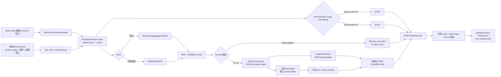

# Portable SAM2 Explicit Coarse：项目架构与文件指南

本文档是新派生项目的结构、接线和使用说明，也是后续代码变更的同步文档。
凡是新增、删除、重命名文件，或改变模型接线、配置参数、训练入口、数据协议、
实验矩阵和验证方式，都应在同一次改动中更新本文档。

## 1. 项目定位与边界

项目根目录：

```text
/home/wangcheng2021/project/portable_sam2_explicit_coarse_new
```

项目包含三个明确隔离的区域：

- `portable_sam2_explicit_coarse/`：唯一的新主线实现和实验入口；
- `sam2/`：随项目固定的官方 SAM2 运行时源码，新主线通过 `SAM2_REPO` 使用；
- `legacy_baseline/`：旧项目冻结复现包，只用于历史基线复现，不被新主线 import。

新主线只保留已经选定的 PAFPN、显式 coarse mask、原生 PromptEncoder 加载和
DenseBR。IIMR、多轮 mask memory、topology token、SABL refined-box 依赖等不属于
新主线。

历史基线与新主线必须使用不同的输出目录，不能覆盖历史 checkpoint。

## 2. 整体架构



### 2.1 两条 Prompt 路线

SAM2 MaskDecoder 的 image embedding 与 detector FPN 解耦选择：现有 B0/B1、M0/M1、C1–C5
保留旧基线 stride-32/32×32；R0/R1 从同一四层 FPN 选择 stride-16/64×64，符合
官方1024输入空间契约。Detector neck 在两种路线中都继续接收完整
256/128/64/32特征，不把分辨率消融混入 RPN/RoI 特征。R0/R1 的 high-res
features 自动对应256×256和128×128，MaskDecoder 原生输出为256×256；legacy
路线对应128×128和64×64，原生输出为128×128。

`prompt_sparse_mode="point"` 是旧基线桥接路线：

- 构造 `point_emb` MLP；
- 使用旧基线的64×64零初始化可训练 image positional embedding，并按当前
  MaskDecoder image embedding插值（B0/B1/M0/M1为32×32，R0为64×64）；
- 不构造 `PromptEncoder`；
- 不构造 `ShapePriorInjector`；
- 不构造 DenseBR。

B0/B1 保持历史 ROI-local final-mask target 与 bbox paste；M0/M1 复用完全相同的
MLP、legacy positional embedding、zero-init trainable no-mask embedding 和训练超参，
只把 `final_mask_coordinate_mode` 切为 `full_image`。因此 B0→M0、B1→M1 只测
final-mask 坐标契约，M0→C1、M1→C2 才是在相同 full-image 契约下比较 MLP/coarse。

`prompt_sparse_mode="shape_point"` 是显式 coarse 路线：

- 不构造旧 `point_emb` MLP；
- 由 `ShapePriorInjector` 产生 ROI-local coarse logits；
- 从 coarse logits 挖掘 2 个正点和 2 个负点；
- 按实验配置增加 box token、dense mask prompt 和 DenseBR；
- 使用相同型号 SAM2 checkpoint 加载并冻结原生 PromptEncoder。
- 默认 `fusion_type="roi_only"`，RoI feature 直接进入 small coarse decoder，
  不构造全图 context、box encoding、cross-attention 或 FiLM gamma/beta 参数；
  `gated_spatial_film` 仅保留为后续显式消融。

### 2.2 coarse 与 DenseBR 接线

- coarse logits 默认大小为 `64×64`，坐标系是 ROI-local；
- 2P2N 挖掘对 coarse logits 使用 stop-gradient；默认按置信度、前景拓扑和点间距
  自适应判定每个点槽是否有效；薄前景和低置信背景有显式 fallback，并记录
  all-invalid ROI 比例；无效点槽在 PromptEncoder 后显式置零，整批全部无效时
  使用真正的空 sparse prompt，不注入四个学习到的 `not_a_point` token；
- `SHAPE_POINT_ADAPTIVE_VALIDITY=0` 是真正的固定有效 2P2N 对照，始终从概率极值
  生成四个空间互斥的点，不再受自适应有效性阈值控制；无法满足距离约束时显式失败；
- point warm-up 默认关闭；开启时训练和当轮 validation/EMA validation 都服从同一
  epoch 阶段，独立 checkpoint 推理默认使用完整2P2N；
- coarse BCE+Dice 默认使用固定权重 `0.10`；未经验证的 `0.20→0.10` epoch
  schedule 只保留为显式策略消融，不再是 C1-C5 隐式默认；
- dense prompt 会被粘贴到 full-image canvas；1024输入的legacy 32×32路线对应
  PromptEncoder `128×128` mask输入，官方64×64路线对应`256×256`；编码后的
  dense embedding delta 被 proposal-box support 限制，box 外保持 no-mask 基底；
- dense 残差按 `base + alpha * (shape_dense - base)` 注入；训练器逐 epoch 汇总
  所有 DDP rank 的有效 `alpha`、注入前/后的 delta norm 及相对 base norm 的 ratio。
  `alpha` 非零只表示门已打开，`applied_delta_ratio` 非零才表示 coarse dense prompt
  实际改变了送入 MaskDecoder 的 dense embedding；
- FiLM 默认关闭：`roi_only` 完全跳过 global visual context、RoI box encoding、
  cross-attention 和 gamma/beta heads。显式设置
  `SHAPE_CONTEXT_FUSION=gated_spatial_film` 时才构造这些模块；此时 global context
  固定二维8×8池化为64 tokens，并关闭未使用的 attention weights；
- DenseBR 位于 PromptEncoder 之前，输入和输出都在 ROI-local logit 空间；
- 开启 DenseBR 时，其输出是 coarse loss、2P2N 和 dense canvas 的统一来源；
- 冻结 PromptEncoder 参数时不使用 `torch.no_grad()`，最终 mask loss 仍能回传到
  coarse head 和 DenseBR。
- B0/B1 为复现历史结果，继续通过 `mask_target()` 使用 ROI-local target，并在
  validation/inference 中按 bbox paste。M0/M1 与 C1–C5 的 SAM2 decoder 输出保留原生
  full-image 网格：训练直接对齐整图 GT，validation/inference 只 resize 到目标
  图像尺寸一次，不再按 bbox 二次粘贴。该模式保存在 `cfg.model` 和 checkpoint。
- B0/B1/M0/M1 的 `no_mask_embed` 对齐旧 MLP 基线：零初始化、可训练；C1-C5 将
  SAM2 预训练 no-mask embedding 作为 PromptEncoder 路线的一部分加载并冻结。
  C1-C5 不允许缺失路径/key 时回退到全零：MaskHead 与 PromptEncoder 必须从同一
  checkpoint 得到完全一致的值，否则模型构建立即失败；INIT_FROM、RESUME、EMA
  和 checkpoint 推理加载后都会再次校验，拒绝旧的零值/漂移 checkpoint 静默覆盖。

## 3. 顶层目录与文件

| 路径 | 用途 |
|---|---|
| `README.md` | 项目概览、基线复现和新主线快速入口。 |
| `PROJECT_ARCHITECTURE.md` | 本文档；架构、逐文件说明和维护契约的事实来源。 |
| `MIGRATION_MANIFEST.md` | 记录两个参考项目、选取内容、排除内容和复现规则。 |
| `.gitignore` | 顶层 Git 忽略规则。 |
| `scripts/verify_legacy_baseline.sh` | 校验冻结基线文件和 SHA256 完整性。 |
| `scripts/reproduce_legacy_bbox.sh` | 进入冻结包并复现历史 bbox 最强基线。 |
| `scripts/reproduce_legacy_segm.sh` | 进入冻结包并复现历史 segm 最强基线。 |
| `sam2/` | 固定的 SAM2 Python 包及 Hydra 配置；除明确升级 SAM2 外不要修改。 |
| `legacy_baseline/` | 冻结旧项目和完整性清单；不承载新功能。 |
| `portable_sam2_explicit_coarse/` | 新主线源码、配置、训练和消融入口。 |

## 4. 新主线逐文件说明

### 4.1 配置：`portable_sam2_explicit_coarse/configs/`

| 文件 | 用途 |
|---|---|
| `_sam2_registry.py` | 将 SAM2 型号映射到 checkpoint、Hydra YAML 和 neck 通道；解析 `SAM2_MODEL_SIZE`、`SAM2_CKPT`、`SAM2_REPO`。 |
| `rsprompter_anchor_satS_v11_sam2_large_full.py` | 继承自旧项目的完整 MMEngine 基础配置，定义 detector、RPN、RoI head、优化相关默认值。 |
| `whu1024_baseplus_clean.py` | WHU-1024 / SAM2 Base+ 的干净桥接基线；通过 `NECK_TYPE` 切换 aggregator/PAFPN，默认使用旧 MLP prompt 路线。 |
| `whu1024_baseplus_explicit_coarse.py` | 显式 coarse 主配置；通过环境变量选择 points、points+box、points+box+dense 和 DenseBR。 |

配置继承关系：

```text
rsprompter_anchor_satS_v11_sam2_large_full.py
└── whu1024_baseplus_clean.py
    └── whu1024_baseplus_explicit_coarse.py
```

### 4.2 模型：`portable_sam2_explicit_coarse/rsprompter/`

| 文件 | 用途 |
|---|---|
| `__init__.py` | 注册 MMDetection 模型组件；`RSPROMPTER_LIGHT_IMPORT=1` 用于轻量张量测试。 |
| `models.py` | detector、RoI head、bbox head 和旧 SAM/RSPrompter 兼容组件；新主线 proposal prompt 接线也在这里。 |
| `models_sam2.py` | SAM2 主实现：vision encoder、基线 aggregator、PAFPN、MaskDecoder wrapper、MLP/coarse 双路线 MaskHead。 |
| `shape_prior.py` | `ShapePriorInjector`、小型 coarse mask decoder、RoI box encoding 和 `ShapePointMiner`。 |
| `coarse_mask_loss.py` | coarse mask 的 BCE、Dice、boundary、distance 组合损失及权重调度。 |
| `dense_prompt_utils.py` | coarse logit 变换，以及 ROI-local mask 向 full-image PromptEncoder canvas 的粘贴。 |
| `densebr.py` | ROI-local Dense Boundary Refiner；使用图像/ROI/prompt cue 产生受限残差。 |
| `ckpt_utils.py` | SAM2 子模块 checkpoint 的严格加载、key 过滤和主进程日志。 |

关键类的定位：

- `RSSAM2VisionEncoder`：SAM2 Base+ 图像编码器与 LoRA；
- `RSFeatureAggregatorSAM2`：旧 neck 对照；
- `RSSAM2PAFPN`：四层 SAM2 特征的 PAFPN；
- `RSPrompterAnchorMaskHeadSAM2`：决定走 MLP 还是显式 coarse；
- `ShapePriorInjector`：产生 coarse logits；
- `ShapePointMiner`：从 coarse logits 产生 2P2N；
- `DenseBR`：在 PromptEncoder 前细化 coarse logits。

### 4.3 数据：`portable_sam2_explicit_coarse/data/`

| 文件 | 用途 |
|---|---|
| `__init__.py` | 导出 `create_train_loader` 并注册 `AdaptiveResize`。 |
| `loader.py` | 统一构造 train/validation DataLoader；实现独立、确定性的 train/val 子集抽样。 |
| `whu_instance_dataset.py` | 当前 WHU COCO 实例分割数据集实现。 |
| `satellite_dataset.py` | 旧 LabelMe 卫星数据兼容数据集。 |
| `satellite_drone_dataset.py` | 旧卫星/UAV 双流兼容数据集；当前 WHU 主线不使用。 |

WHU 默认路径：

```text
2.1 train/train
2.3 valid/validation
2.4 annotation/annotation/train.json
2.4 annotation/annotation/validation.json
```

训练器和 DataLoader API 的比例默认均为 `1.0`；消融运行器当前将
`TRAIN_SUBSET_RATIO` 默认设为 `0.2`，`VAL_SUBSET_RATIO` 默认保持 `1.0`，即
20% train / 100% validation。小于 1 时按图像级确定性抽样；训练使用
`SUBSET_SEED`，验证使用 `SUBSET_SEED + 10000`。

训练数据口径与 WHU1024 历史基线一致：无有效 GT 的训练 batch 仍进入 detector
loss，不做 rank-local 跳过。四卡的 `DistributedSampler` shard 可能包含不同数量的
空标注图像，因此任何只在单个 rank 生效的提前 `continue` 都会破坏 DDP collective
顺序；训练主循环必须保证所有 rank 每个 iteration 经过相同的 finite-check 和梯度
同步路径。

验证执行契约与 WHU1024 历史基线一致：

- validation batch size 默认固定为 `1`；
- 四卡 DDP 时只有全局 rank 0 顺序遍历完整 validation，其他 rank 在既有
  epoch-end 同步点等待，不重复累计全分辨率预测 mask；
- `VAL_EVERY_N_EPOCHS` 决定验证周期；
- 无有效 GT 的图像不计算 validation loss，但仍进入 COCO 评估以计入假阳性；
- `segm_score_mode` 是训练 validation 与 checkpoint 推理共用、随 `cfg.model`
  保存的排序契约；当前全部消融默认 `detector`，因此 bbox/segm 都使用 detector
  score 并共享同一 COCO detection 对象；显式 `mask_quality` 时只为 segm 构造
  quality-score COCO DT，bbox 仍使用 detector score；
- `mask_quality` 必须同时启用 quality head 且预测中真实存在 `mask_scores`；配置
  不完整或字段缺失时立即报错，不允许静默回退导致训练/推理指标口径分叉；
- bbox 主摘要和 best-bbox checkpoint 默认按旧基线的 `bbox/mAP`；
  `bbox/mAP_75` 仍作为详细指标输出，可用 `SAVE_BBOX_BEST_METRIC` 显式覆盖；
- segm 后处理按模型配置选择：B0/B1 使用 ROI-local bbox paste，M0/M1 与 C1–C5 使用
  full-image resize；独立推理复用完全相同的 `model.predict` 路径；
- validation 后执行 CUDA cache 和 Python GC 清理。

### 4.4 训练：`portable_sam2_explicit_coarse/train/`

| 文件 | 用途 |
|---|---|
| `__init__.py` | 训练包标记。 |
| `train_rsprompter_fusion.py` | DDP 训练主入口；负责配置构建、参数组、EMA、checkpoint、断点恢复、COCO bbox/segm 验证和子集参数。 |

常用 CLI：

- `--config`：MMEngine 配置；
- `--data-root`、`--use-whu-coco`：WHU 数据入口；
- `--train-subset-ratio`、`--val-subset-ratio`：独立子集；
- `--init-from`：只加载模型权重开始新实验；
- `--resume-from`：恢复模型、优化器、epoch 等完整训练状态；
- `--max-train-batches`、`--max-val-batches`：快速 smoke；
- `--val-batch-size`：验证 batch size，默认 `1`，保持 WHU1024 历史基线口径；
- `--shape-prior-lr-mult`、`--densebr-lr-mult`：新模块学习率倍率。

训练器和全部 B0/B1、M0/M1、C1–C5 消融 wrapper 的公共优化默认值对齐 WHU1024 历史最强基线：
每卡 batch `1`、梯度累积 `2`、四卡有效 batch `8`、基础 LR `5e-4`、backbone
与其余主干倍率 `1.0`、mask decoder/no-mask 倍率 `1.0`、weight decay `0.05`、
warmup `100` optimizer steps、EMA decay `0.999`/每步更新/epoch 5 起评估。
detector loss在全部epoch保持权重`1.0`；阶段边界仍归档，但默认不再在epoch 6/11
静默降为`0.75/0.50`。最终mask训练同时记录ROI target fill、logit均值/方差、概率
均值和阈值前景率，便于第一轮识别整图target或全空mask回归。
early stopping 使用 segm mAP、平滑窗 `5`、patience `10`、epoch `20` 前不计数、
min delta `5e-4`。这些值由公共运行器统一传入，所有架构消融默认一致。
DDP process-group timeout 同样由公共运行器统一设置为 `1800` 秒，对齐冻结历史
基线启动器，使 rank 1–3 等待 rank 0 完整 validation 与 COCO bbox/segm 评估时
不会触发 PyTorch 默认 600 秒超时。最外围可用 `TORCH_DDP_TIMEOUT_SECONDS`
覆盖；兼容旧变量 `NCCL_TIMEOUT` 作为次级回退。

新 checkpoint schema version 为 `1`，其中 `config_snapshot` 保存：

- 完整解析后的 `model_config`；
- 完整 `training_args`；
- validation/test 数据路径、图像尺寸和类别协议；
- SAM2 repo、checkpoint 和型号；
- Prompt 路线、neck、DenseBR、训练计划及学习率倍率。

恢复旧 checkpoint 续训时会保留旧实验记录，并补入新 schema 中缺失的字段。

### 4.5 推理：`portable_sam2_explicit_coarse/inference/`

| 文件 | 用途 |
|---|---|
| `__init__.py` | checkpoint 推理包标记。 |
| `infer_from_checkpoint.py` | 读取指定 checkpoint，恢复自描述模型配置，严格加载 model/EMA 权重，在 WHU validation、test 或自定义 COCO split 上推理与评估。 |

推理默认使用 `checkpoint["model"]`。`--weights ema` 可显式读取
`checkpoint["ema_state"]["ema_state"]`；训练产生的 best checkpoint 在启用 EMA
评估时，其 `model` 本身已经是当轮用于验证的权重。

新 checkpoint 不需要额外 `.py` 配置。旧 checkpoint 缺少
`config_snapshot.model_config` 时可通过 `--config` 回退。模型构建仍需要项目内
SAM2 Python 包和对应 Base+ 预训练 checkpoint；路径可通过 `--sam2-repo`、
`--sam2-ckpt` 覆盖。

推理调用与训练验证相同的 `model.predict(..., rescale=False)`。MaskHead 根据
checkpoint 中的 `final_mask_coordinate_mode` 选择 ROI-local bbox paste 或
full-image resize；validation、test 和 custom split 同步生效，不维护第二套推理
实现。manifest 对应记录 `roi_local_bbox_paste` 或 `full_image_resize`。
同一 MaskHead 的 `segm_score_mode` 同时决定训练 validation 和独立推理的 segm
COCO 排序键；推理 manifest 记录 `bbox_score_key`、`segm_score_key` 与模式。旧
checkpoint 缺少该字段时由构造函数按历史口径解析为 `detector`。

#### 推理支持范围与参数持久化契约

当前 B0/B1、M0/M1、C1–C5 全部消融路线都支持 checkpoint 驱动推理，包括
aggregator/PAFPN、MLP/coarse、points、box、dense prompt 和 DenseBR。推理器不按
实验名称猜测结构，而是读取 checkpoint 中已经解析完成的 `model_config` 构建
模型，并以 `strict=True` 加载权重。

后续新增参数必须遵守以下归档规则：

| 参数类型 | 必须进入的位置 | 说明 |
|---|---|---|
| 影响模型结构、模块开关、张量形状或 forward/predict 行为 | `cfg.model` | 强制要求；checkpoint 中的 `model_config` 是推理重建的唯一模型事实来源。 |
| 训练优化参数，如学习率、epoch、梯度累积 | `training_args` | 由完整 `vars(args)` 自动保存；若同时影响模型推理行为，也必须进入 `cfg.model`。 |
| 数据路径、split、图像尺寸、类别映射、预处理 | `data_config` | 供推理器重建测试集；其中会改变模型结构的尺寸还必须同步进入 `cfg.model`。 |
| SAM2 repo、基础 checkpoint、型号等外部依赖 | `runtime_config` | 记录默认解析值，并允许推理 CLI 显式覆盖。 |
| 评估阈值、输出或 evaluator 行为 | 推理 CLI 或后续 `inference_config` | 不得通过未记录的临时环境变量改变正式评估口径。 |

禁止只在 shell 环境变量或训练代码局部变量中增加影响模型行为的参数。环境变量可
作为实验入口，但配置文件必须把它解析进 `cfg.model`，然后才能构建模型和保存
checkpoint。训练脚本、推理脚本都不得根据 checkpoint 文件名反推实验结构。

每次新增模型参数时必须同时完成：

1. 在相应 MMEngine 配置中给出明确默认值，并写入 `cfg.model`；
2. 在目标模型类构造函数中接收并校验该参数；
3. 确认训练保存的 `config_snapshot.model_config` 包含解析后的实际值；
4. 使用 `--build-only` 对新 checkpoint 做严格 round-trip，要求 missing 和
   unexpected keys 均为 0；
5. 若旧 checkpoint 无法兼容，提升 `checkpoint_schema_version` 并提供明确迁移或
   `--config` 回退策略；
6. 同步本文档的架构、文件用途、参数和推理支持说明。

### 4.6 运行脚本：`portable_sam2_explicit_coarse/scripts/`

| 文件 | 用途 |
|---|---|
| `run_whu1024_explicit_coarse_4gpu.sh` | 默认四卡全量 PAFPN coarse 主线入口；按 explicit mode/DenseBR 映射到公共消融运行器，继承统一超参、日志和后台生命周期。 |
| `infer_whu_checkpoint.sh` | 指定 checkpoint 的单卡推理 shell 入口；其余参数透传给 Python 推理器。 |
| `smoke_test_components.sh` | 启动轻量组件测试。 |
| `smoke_test_components.py` | 检查 PAFPN、shape prior、2P2N、dense canvas、DenseBR 和梯度契约。 |

`scripts/ablations/`：

| 文件 | 用途 |
|---|---|
| `README.md` | 消融矩阵、子集和 dry-run 用法。 |
| `_run_ablation.sh` | 所有消融共享的受控运行器；固定架构变量、校验契约、记录超参、组装 torchrun；训练默认以 `nohup setsid` 脱离终端并生成日志，不创建 PID 文件。 |
| `validate_ablation_contract.py` | 校验解析后配置、真实数据子集和可选完整模型实例是否与脚本声明一致。 |
| `smoke_all.sh` | 检查全部消融，并对 B0、B1、M0、M1、C1、C5、R0、R1 做代表性完整模型构建。 |
| `monitor_b0_then_serial.sh` | 持续监控当前 B0，结束后串行运行主消融矩阵；单项失败、被杀或脚本缺失时记录并跳过，不阻断后续任务，不创建 PID 文件。 |
| `b0_aggregator_mlp.sh` | Aggregator + 旧 MLP 基线桥接；默认run tag为`b0_aggregator_mlp_aligned`，与修复前无效权重隔离。 |
| `b1_pafpn_mlp.sh` | 只将 neck 切到 PAFPN。 |
| `m0_aggregator_mlp_full_image.sh` | B0 的 full-image final-mask 对照；只切 target/后处理坐标契约。 |
| `m1_pafpn_mlp_full_image.sh` | B1 的 full-image final-mask 对照；只切 target/后处理坐标契约。 |
| `c1_aggregator_coarse_points.sh` | Aggregator + coarse 2P2N。 |
| `c2_pafpn_coarse_points.sh` | PAFPN + coarse 2P2N。 |
| `c3_pafpn_coarse_points_box.sh` | C2 + box prompt。 |
| `c4_pafpn_coarse_points_box_dense.sh` | C3 + dense mask prompt。 |
| `c5_pafpn_coarse_densebr.sh` | C4 + DenseBR。 |
| `r0_b0_aggregator_mlp_emb64.sh` | B0控制的官方stride-16/64×64 image embedding变体。 |
| `r1_c5_pafpn_coarse_densebr_emb64.sh` | C5控制的官方stride-16/64×64 image embedding变体。 |
| `coarse_strategy/README.md` | C2 coarse 策略筛选说明。 |
| `coarse_strategy/s0_c2_fixed_w010.sh` | adaptive 2P2N + 固定 coarse loss 0.10。 |
| `coarse_strategy/s1_c2_fixed_w020.sh` | adaptive 2P2N + 固定 coarse loss 0.20。 |
| `coarse_strategy/s2_c2_two_stage_w020_w010.sh` | adaptive 2P2N + epoch 1–5 为 0.20、之后为 0.10。 |

### 4.7 工具与通用函数

| 文件 | 用途 |
|---|---|
| `tools/mask_to_coco_whu512.py` | 将 WHU 二值 mask 转为 COCO polygon 标注；属于数据准备工具，不是训练必需步骤。 |
| `utils/__init__.py` | 通用工具包标记。 |
| `utils/coco_eval_utils.py` | 构造 COCO GT/DT 并执行 bbox/segm COCOeval；支持 bbox score 和 mask score 两种评估分数。 |
| `utils/transforms.py` | `AdaptiveResize` MMDetection transform。 |
| `.gitignore` | 忽略本地缓存、运行产物等。 |

### 4.8 运行产物

`portable_sam2_explicit_coarse/logs/ablations/` 是当前 B0/B1、M0/M1、C1–C5 消融运行器的默认
日志目录。每次运行只生成独立 `.log`，不生成 `.pid`。默认后台模式下，
终端只显示启动摘要、后台 PID 和日志路径，后续 stdout/stderr 仅落盘；
`RUN_IN_BACKGROUND=0` 时才持续同步显示在终端。日志
开头的 `resolved_hyperparameters_begin/end` 块记录解析后的架构路线、数据比例、
优化器、EMA、初始化/续训、有效全局 batch size、git commit 和精确 torchrun
命令。最外层脚本接受 `--master-port <port>` 或 `--master-port=<port>`；端口优先级为
命令行、`MASTER_PORT` 环境变量、按启动 PID 自动派生，避免并发后台实验都抢占旧默认
`29500`。全部入口还共享 1800 秒 DDP timeout。端口、DDP timeout 及其来源均写入
快照；DDP timeout 也归档在 checkpoint 的 `runtime_config` 中。
使用 dense prompt 的实验每个 epoch 还会固定输出
`dense residual monitor: alpha=... source_delta_norm=... applied_delta_norm=...
source_delta_ratio=... applied_delta_ratio=...`。这些值跨 DDP rank 聚合，不依赖
`PROMPT_DEBUG_STATS`；若启用该开关，周期性 `[DEBUG-DENSE]` 日志也会输出同一组
最近一次前向值以及 canvas/base/shape/final 统计。B0、C1-C3 等未启用 dense prompt
的路线不会伪造该日志行。
`logs/` 下其余目录保留历史运行日志和 `.params` 快照，均不是模型源码。

新的 checkpoint 默认写到
`/data/wangcheng/checkpoint/portable_sam2_explicit_coarse/`，不应提交
checkpoint、临时日志、`__pycache__` 或数据集；项目内 `logs/` 已由 Git 忽略。
本次语义修复后的 C1–C5、R1 和 coarse-strategy wrapper 默认 run tag 包含
`_semanticfix_roi_only`，主线全量入口的默认 checkpoint 目录也包含该后缀，避免与
修复前坐标/点策略及旧 FiLM checkpoint 混写。显式开启 FiLM 时自动改为
`_semanticfix_gated_spatial_film`；显式设置 `RUN_TAG`/`CHECKPOINT_DIR` 时仍以用户值为准。

推理默认在 checkpoint 同级创建 `inference_<split>/`：

- `predictions.json`：带 bbox、score、mask score 和 COCO RLE mask 的预测；
- `metrics.json`：有标注测试集上的 bbox/segm COCO 指标；
- `run_manifest.json`：checkpoint、配置来源、严格加载结果、数据协议和输出摘要。

## 5. 常用操作

所有新主线命令从以下目录执行：

```bash
cd /home/wangcheng2021/project/portable_sam2_explicit_coarse_new/portable_sam2_explicit_coarse
```

组件 smoke：

```bash
bash scripts/smoke_test_components.sh
```

消融 smoke，不启动训练：

```bash
# 配置、命令、真实子集和代表性完整模型构建
bash scripts/ablations/smoke_all.sh

# 跳过完整模型构建的快速检查
FULL_MODEL_SMOKE=0 bash scripts/ablations/smoke_all.sh
```

按消融当前默认口径启动 20% train / 100% validation：

```bash
bash scripts/ablations/c4_pafpn_coarse_points_box_dense.sh
```

该命令会在终端打印实际日志文件路径，并默认写入
`logs/ablations/<run_tag>_tr0.2_va1.0_<timestamp>_pid<pid>.log`。训练默认在后台
运行，命令返回不代表训练结束；使用启动时打印的日志路径和 `background_pid` 跟踪，
运行器不保存 PID 文件。需要外置日志时
可设置 `LOG_DIR`，需要固定文件名时可设置 `LOG_FILE`。

并行实验从最外层脚本指定不同端口：

```bash
bash scripts/ablations/b0_aggregator_mlp.sh --master-port 29601
bash scripts/ablations/c2_pafpn_coarse_points.sh --master-port=29602
```

前台调试：

```bash
RUN_IN_BACKGROUND=0 bash scripts/ablations/b0_aggregator_mlp.sh
```

后台持续等待当前 B0，随后串行执行 B1、M0、M1、C1-C5、R0、R1：

```bash
B0_LOG=/absolute/path/to/current_b0.log \
nohup setsid bash scripts/ablations/monitor_b0_then_serial.sh \
  >/dev/null 2>&1 &
```

监视器自身不保存 PID 文件，使用非阻塞锁防止重复队列；事件默认写到
`logs/ablations/serial_after_b0_<timestamp>.log`。每个子实验仍写各自的完整训练日志。
子实验退出码非零、被杀或脚本缺失时会被记为 failed/skipped，并继续下一项。
`POLL_SECONDS` 可覆盖轮询间隔，`ABLATION_QUEUE` 可替换默认脚本序列；
`--print-plan` 只打印解析后的队列，不等待或启动实验。

显式启动完整数据实验：

```bash
TRAIN_SUBSET_RATIO=1.0 VAL_SUBSET_RATIO=1.0 \
bash scripts/ablations/c5_pafpn_coarse_densebr.sh
```

只解析和核验，不训练：

```bash
DRY_RUN=1 CHECK_DATA=1 PREFLIGHT_MODEL=1 \
bash scripts/ablations/c5_pafpn_coarse_densebr.sh
```

从 checkpoint 在完整 validation 上推理：

```bash
bash scripts/infer_whu_checkpoint.sh /path/to/best_model.pth
```

在 WHU test split 上推理：

```bash
bash scripts/infer_whu_checkpoint.sh /path/to/best_model.pth --split test
```

自定义 COCO 测试集：

```bash
bash scripts/infer_whu_checkpoint.sh /path/to/best_model.pth \
  --split custom \
  --data-root /path/to/dataset \
  --ann-file annotations/test.json \
  --image-subdir test/images
```

只查看 checkpoint 元数据或只验证模型重建：

```bash
bash scripts/infer_whu_checkpoint.sh /path/to/model.pth --inspect-only
bash scripts/infer_whu_checkpoint.sh /path/to/model.pth --build-only --device cpu
```

复现冻结历史基线：

```bash
cd /home/wangcheng2021/project/portable_sam2_explicit_coarse_new
bash scripts/verify_legacy_baseline.sh
bash scripts/reproduce_legacy_segm.sh
```

## 6. 主要环境变量

| 变量 | 默认值/含义 |
|---|---|
| `SAM2_REPO` | 项目内 `../sam2`。 |
| `SAM2_CKPT` | `/data/wangcheng/pretrained-models/sam2/sam2_hiera_base_plus.pt`。 |
| `WHU1024_DATA_ROOT` | `/data/wangcheng/dataset/WHU`。 |
| `NECK_TYPE` | `aggregator` 或 `pafpn`；消融 wrapper 会固定。 |
| `EXPLICIT_PROMPT_MODE` | `points`、`points_box` 或 `points_box_dense`。 |
| `FINAL_MASK_COORDINATE_MODE` | MLP clean config 的最终 mask 坐标契约，默认 `roi_local`；公共 wrapper 将 B0/B1/R0 固定为 `roi_local`、M0/M1 固定为 `full_image`，coarse 路线固定为 `full_image`。解析进 `cfg.model` 和 checkpoint。 |
| `DENSEBR_ENABLED` | `0/1`。 |
| `SHAPE_CONTEXT_FUSION` | coarse feature fusion；默认 `roi_only`，完全不构造 FiLM/context 参数；后续显式消融可设为 `gated_spatial_film`，`legacy_multiplicative` 仅作兼容对照。解析进 `cfg.model` 和 checkpoint。 |
| `DENSEBR_BETA_INIT` / `DENSEBR_BETA_MAX` | DenseBR 初始/最大残差幅度，默认 `0.05/0.20`；解析进 `cfg.model`。 |
| `DENSEBR_DELTA_LOGIT_MAX` | 单像素残差 logit 上界，默认 `2.0`。 |
| `DENSEBR_QUALITY_GATE_INIT` | ROI quality gate 初值，默认 `0.50`。 |
| `DENSEBR_ROI_CHANNELS` / `DENSEBR_CUE_CHANNELS` / `DENSEBR_MID_CHANNELS` | DenseBR 通道数，默认 `64/32/64`。 |
| `DENSEBR_DETACH_PROMPT_CUES` | `0/1`，默认 `1`；非法值直接失败。 |
| `SAM_IMAGE_EMBED_STRIDE` | SAM2 MaskDecoder image embedding步长；现有B0/B1、M0/M1、C1–C5默认`32`，R0/R1 wrapper固定`16`（1024输入为64×64）。 |
| `SHAPE_POINT_ADAPTIVE_VALIDITY` | `1` 默认自适应点槽有效性；`0` 固定输出有效 2P2N 极值点。 |
| `POINT_WARMUP_ENABLED` | 默认 `0`；若开启，阶段长度由三个 `POINT_WARMUP_*` 变量定义。 |
| `SHAPE_LOSS_SCHEDULE_MODE` | `fixed`（默认）或 `two_stage`。 |
| `SHAPE_PRIOR_LOSS_WEIGHT` | fixed 模式的真实 coarse loss 权重，默认 `0.10`。 |
| `SHAPE_LOSS_STAGE1_END` | two-stage 第一阶段结束 epoch，默认 `5`。 |
| `SHAPE_LOSS_WEIGHT_STAGE1` | two-stage 第一阶段权重，默认 `0.20`。 |
| `SHAPE_LOSS_WEIGHT_STAGE2` | two-stage 第二阶段权重，默认 `0.10`。 |
| `PROMPT_DEBUG_STATS` | coarse wrapper 默认 `1`、MLP wrapper 默认 `0`。 |
| `PROMPT_DEBUG_STATS_INTERVAL` | prompt 诊断训练迭代间隔，默认 `50`。 |
| `TRAIN_SUBSET_RATIO` | 训练集比例；消融运行器当前默认 `0.2`，训练器 API 默认 `1.0`。 |
| `VAL_SUBSET_RATIO` | 验证集比例；消融运行器和训练器 API 均默认 `1.0`。 |
| `VAL_BATCH_SIZE` | 验证 batch size，默认 `1`；全部启动入口保持历史基线口径。 |
| `VAL_EVERY_N_EPOCHS` | 每多少个 epoch 验证一次，默认 `1`。 |
| `SAVE_BBOX_BEST_METRIC` | bbox 主摘要与 best-bbox checkpoint 指标，默认旧基线口径 `bbox/mAP`。 |
| `SEGM_SCORE_MODE` | segm COCO 排序契约，写入 `cfg.model.roi_head.mask_head` 和 checkpoint；当前消融默认 `detector`，训练/推理均用 detector `scores`。`mask_quality` 仅允许与已启用 quality head 配套，缺少 `mask_scores` 时直接失败。候选阈值、NMS、`max_per_img` 始终仍按 detector score。 |
| `BATCH_SIZE` | 每卡训练 batch，默认 `1`。 |
| `GRAD_ACCUM_STEPS` | 梯度累积步数，默认 `2`；默认四卡有效 batch 为 `8`。 |
| `LEARNING_RATE` | 基础学习率，默认 `5e-4`。 |
| `SAT_BACKBONE_LR_MULT` | SAM2 backbone 学习率倍率，默认 `1.0`。 |
| `SAT_OTHER_LR_MULT` | detector 其余参数学习率倍率，默认 `1.0`。 |
| `MASK_DECODER_LR_MULT` | mask decoder 学习率倍率，默认 `1.0`。 |
| `NO_MASK_LR_MULT` | B0/B1/M0/M1 trainable no-mask 参数倍率，默认 `1.0`。 |
| `WARMUP_ITERS` | warmup optimizer steps，默认 `100`。 |
| `WEIGHT_DECAY` | AdamW weight decay，默认 `0.05`。 |
| `DET_LOSS_STAGE1_END` / `DET_LOSS_STAGE2_END` | detector loss阶段边界，默认`5/10`；仅供显式权重消融。 |
| `DET_LOSS_WEIGHT_STAGE1/2/3` | detector loss三阶段权重；公共运行器默认均为`1.0`，对齐旧基线恒定检测监督。 |
| `EARLY_STOPPING_SMOOTH_WINDOW` | early-stop 指标平滑窗，默认 `5`。 |
| `EARLY_STOPPING_MIN_DELTA` | early-stop 最小提升，默认 `5e-4`。 |
| `SUBSET_SEED` | 子集与训练随机种子，默认 `44`。 |
| `MAX_EPOCHS` | 最大 epoch，默认 `80`。 |
| `CHECKPOINT_DIR` | 实验输出目录；消融运行器会按实验和子集自动隔离。 |
| `LOG_DIR` | 消融终端日志目录，默认 `<项目主代码>/logs/ablations`。 |
| `LOG_FILE` | 消融日志的精确文件路径；设置后优先于 `LOG_DIR` 自动命名。 |
| `RUN_IN_BACKGROUND` | 训练启动方式；默认 `1`，以 `nohup setsid` 脱离终端；设为 `0` 前台运行。dry-run 不启动进程。 |
| `INIT_FROM` | 初始化 checkpoint。 |
| `RESUME_FROM` | 完整断点恢复 checkpoint。 |
| `CUDA_VISIBLE_DEVICES` | 可见 GPU，默认 `0,1,2,3`。 |
| `NPROC_PER_NODE` | DDP 进程数，默认 `4`。 |
| `MASTER_PORT` / `--master-port` | torchrun rendezvous 端口；最外层脚本的 CLI 参数优先，其次为环境变量，均未设置时按 launcher PID 自动派生。 |
| `TORCH_DDP_TIMEOUT_SECONDS` | DDP collective timeout，公共运行器默认 `1800` 秒，全部 B0/B1、M0/M1、C1–C5、coarse-strategy 和主线四卡入口共享；最外围可覆盖。 |
| `NCCL_TIMEOUT` | 旧基线兼容别名；仅在未设置 `TORCH_DDP_TIMEOUT_SECONDS` 时作为回退。 |

## 7. 修改项目时的文档同步规则

每次变更结束前检查：

1. 新增、删除或重命名文件：更新第 3、4 节的目录和逐文件说明；
2. 修改模型数据流或模块开关：更新第 2 节架构与接线；
3. 修改配置继承或环境变量：更新第 4.1、6 节；
4. 修改数据划分、路径或抽样：更新第 4.3 节；
5. 修改训练 CLI、checkpoint 或评估协议：更新第 4.4、5 节；
6. 新增实验 wrapper：更新消融表、命令示例和 `scripts/ablations/README.md`；
7. 新增影响模型或推理行为的参数：强制并入 `cfg.model`，并执行 checkpoint
   round-trip；
8. 运行与改动风险相称的 smoke，并确保文档描述的是实际解析后的行为；
9. 将本文档与对应代码放进同一个 Git 提交。

如果代码与文档冲突，以经过检查的代码行为为依据修正文档，不要保留未经验证的
计划性描述。

全局 skill 位于
`/home/wangcheng2021/.codex/skills/maintain-explicit-coarse-docs/`。当 Codex
处理本项目的新增或改动时，它负责默认执行上述同步流程。

## 8. 文档同步记录

- 2026-07-29：修复训练 validation 与 checkpoint 推理潜在的 segm 排序分数分叉。
  新增随 `cfg.model`/checkpoint 保存的 `segm_score_mode` 单一契约；当前 B0/B1、
  M0/M1、C1-C5、R0/R1 默认 `detector`，两条评估路径都使用 detector `scores`。
  显式 `mask_quality` 时两端统一使用 `mask_scores`，但必须同时启用 quality head；
  evaluator 对缺失 score key 改为直接失败，不再静默回退。消融参数快照、配置契约、
  推理 manifest 与组件 smoke 同步覆盖该行为；候选阈值、NMS 和 max-per-image 仍固定
  使用 detector score。
- 2026-07-29：新增 B0 后置串行消融监视器。监视器以 detached 方式持续等待当前
  B0 进程结束，随后默认串行运行 B1、M0、M1、C1-C5、R0、R1；每个 wrapper 在
  监视器内以前台子进程执行，确保严格串行。单项非零退出、被杀或脚本缺失时记录
  后自动进入下一项；使用非阻塞锁防止重复队列，不创建 PID 文件，并保留每项原有
  独立训练日志与总队列事件日志。
- 2026-07-29：新增 M0/M1 full-image MLP 消融，消除 B0→C1、B1→C2 同时改变
  prompt 路线和 final-mask 坐标契约的混杂。M0=Aggregator+MLP+full-image，
  M1=PAFPN+MLP+full-image；两者保持 B0/B1 的 positional/no-mask/优化契约，只切
  full-image target 与单次 resize 后处理。公共运行器、配置验证、完整模型 preflight、
  日志快照、checkpoint 模型配置和消融 smoke 均显式核验该模式。
- 2026-07-29：在前序消融完成前默认关闭未经验证的 coarse FiLM。C1–C5、R1、
  coarse-strategy 和主线入口统一解析 `SHAPE_CONTEXT_FUSION=roi_only`；该模式直接以
  RoI feature 生成 coarse mask，完全不构造/计算 global context、box encoding、
  cross-attention、gamma/beta 或 context gate。FiLM 实现仍可用
  `gated_spatial_film` 显式恢复，配置随 checkpoint 保存；默认 run tag 按实际模式
  自动隔离，配置契约和组件 smoke 覆盖两种路线。
- 2026-07-29：dense coarse 分支新增可观测性：MaskHead 持久化每次前向的有效
  residual alpha，并计算 source/applied delta 的绝对 norm 与相对 base norm；训练器
  在每个 epoch 跨全部 DDP rank 汇总并写入标准日志，周期性 prompt debug 同时可见
  单步值。由此可区分“alpha 门已打开”和“coarse prompt 实际改变 dense embedding”。
- 2026-07-29：完成 PAFPN/coarse/DenseBR 迁移后语义审查修复。B0/B1 保留历史
  ROI-local target+bbox-paste 复现口径，C1–C5 改用 SAM2 原生 full-image final-mask
  target 与单次 resize 后处理；checkpoint 推理按模型配置选择并记录后处理。修复
  fixed 2P2N 正负坐标重合、adaptive 薄前景/背景 fallback、all-invalid 四个伪
  `not_a_point` token，以及 point warm-up 训练/验证阶段不一致。ShapePrior context
  改为固定二维8×8池化并关闭未使用 attention weights，未知配置键不再静默吞掉；
  dense embedding delta 限制在 proposal box 内。PAFPN 不再强制 FP32；DenseBR
  beta/delta/gate/channel/detach 环境参数全部解析进 `cfg.model`、日志快照和消融契约。
  组件 smoke 新增 full-image target/后处理、点互斥、warm-up一致性、空prompt、二维
  context、dense box support、dtype与严格配置回归；修复后的 coarse wrapper 默认
  run tag 追加 `_semanticfix`，隔离旧 checkpoint。
- 2026-07-29：将B0及其MLP对照路线重新对齐旧WHU1024基线：恢复64×64零初始化、
  可训练并按decoder尺寸插值的legacy image positional embedding，移除误接的固定
  `PositionEmbeddingSine`；公共消融运行器将detector loss三阶段默认权重统一为
  `1.0/1.0/1.0`并完整穿透/记录。恢复final-mask target fill、logit、概率与阈值
  前景率统计；配置契约新增legacy PE零初始化、可训练性、有效尺寸检查。B0默认
  使用新的`b0_aggregator_mlp_aligned` run tag隔离修复前checkpoint。EMA仍保留
  历史基线的decay 0.999和epoch 5切换行为，不把EMA算法改动混入本次基线对齐。
- 2026-07-29：新增两组 SAM2 image embedding 分辨率消融：R0在B0基础上、R1在
  C5基础上切换到官方stride-16/64×64；原B0/C5及B1/C1-C4保持legacy
  stride-32/32×32。Detector继续使用完整四层FPN，MaskDecoder按配置选择目标层；
  64×64路线同步使用256/128 high-res features、64×64 PromptEncoder PE和256×256
  dense-mask输入。新增模型配置持久化、公共日志快照、参数契约、32/64选择组件
  smoke、R0/R1完整模型preflight和独立wrapper/checkpoint目录。
- 2026-07-29：修复 C5（并覆盖全部 C1-C5 coarse 路线）的 pretrained
  `no_mask_embed` 静默回退：请求预训练值时，checkpoint 路径缺失、key 缺失、shape
  错误或非有限值现在直接失败，不再创建全零冻结参数；模型构建同时核对 MaskHead
  与 PromptEncoder 的 no-mask 值。新增构建、INIT_FROM、RESUME、EMA、checkpoint
  推理后的完整性校验，以及缺失 checkpoint 路径/key 回归 smoke 和 coarse full-model
  preflight 断言。B0/B1 显式声明的零初始化可训练路线保持不变。
- 2026-07-28：恢复旧 WHU1024 基线的 DDP timeout 接线；公共运行器为全部
  B0–C5、coarse-strategy 和主线四卡入口统一设置 1800 秒，支持最外围通过
  `TORCH_DDP_TIMEOUT_SECONDS` 覆盖并兼容 `NCCL_TIMEOUT` 回退。训练器将解析值传给
  `init_process_group`，启动日志记录值/来源，checkpoint `runtime_config` 同步归档。
- 2026-07-28：全部 B0–C5、coarse-strategy 和主线四卡训练入口默认改为
  `nohup setsid` 后台运行，关闭启动终端不再终止 torchrun；每次运行只生成独立
  `.log`，打印 `background_pid` 但不保存 PID 文件；`RUN_IN_BACKGROUND=0` 保留前台调试，
  dry-run/smoke 不启动后台训练。最外层脚本支持 `--master-port` 覆盖，优先级高于
  `MASTER_PORT` 环境变量；均未指定时按 launcher PID 自动派生 rendezvous 端口以支持
  并发。主线四卡脚本复用公共运行器，消除重复超参。
- 2026-07-29：纠正 2026-07-28 未完整落地的最终 mask target 修复：共享 mask
  head 的训练 target 已实际改回旧基线的 MMDetection `mask_target()`，按每个正样本
  proposal crop GT 后 resize 为 ROI-local target；预测继续按检测框 paste 回整图。
  新增直接区分 ROI crop 与整图 resize 的组件回归 smoke，并在验证日志输出预测
  mask 数量/填充率。该实现由 B0–C5、coarse-strategy、validation 和 checkpoint
  推理共同复用；bbox 主摘要和 best-bbox 默认恢复为 `bbox/mAP`。
- 2026-07-28：恢复最终实例 mask 的 bbox paste 路径：训练验证和 checkpoint 推理
  共用同一 `model.predict` 路径；新增完整模型 smoke 的框内粘贴断言。B0/B1 同时恢复
  零初始化可训练 no-mask embedding；全部 B0-C5 统一恢复旧基线的
  batch1×accum2、LR 倍率、weight decay、100-step warmup、EMA 和平滑
  early-stopping 超参。
- 2026-07-28：修正未验证的 coarse 动态策略默认值和参数契约：
  `adaptive_validity` 现可真实切换 adaptive/fixed 2P2N；C1–C5 默认改为固定
  coarse loss 0.10；two-stage 权重成为显式 S2 消融；新增 all-invalid 和默认
  prompt 诊断、CLI 透传、S0/S1/S2 策略脚本及解析后超参快照。同步记录当前
  公共消融运行器已有的 20% train / 100% validation 默认口径；旧 checkpoint
  缺少 `schedule_mode` 时会按已有 `weight_schedule` 自动推断，保持可重建。
- 2026-07-28：修复 B0 在 Epoch 2 因 rank-local 空 GT batch 提前跳过而产生的
  NCCL collective 错位；训练恢复历史 WHU1024 基线口径，空 GT batch 仍进入
  detector loss，所有 rank 保持相同的 iteration/collective 顺序。
- 2026-07-28：修复新主线 DDP validation 回归；全部实验默认恢复 WHU1024
  历史基线的 rank-0-only 完整验证、`val_batch_size=1`、验证周期、空 GT 图像
  计入 COCO、detector-score 排序和验证后内存清理契约。
- 2026-07-28：消融公共运行器新增终端 stdout/stderr 自动落盘；默认写入项目内
  `logs/ablations/`，并在日志开头记录解析后的完整实验超参快照、git commit
  与精确 torchrun 命令。
- 2026-07-28：明确 checkpoint 推理覆盖全部 B0–C5；建立未来参数持久化契约，
  要求所有影响模型结构或 forward/predict 行为的新参数强制进入 `cfg.model`，
  并通过严格 checkpoint round-trip。
- 2026-07-28：新增自描述 checkpoint schema 和 checkpoint 驱动推理入口；支持
  validation/test/custom COCO split、严格 model/EMA 权重加载、bbox/segm COCO
  评估以及 predictions/metrics/manifest 输出。
- 2026-07-28：曾将全部消融 wrapper 的默认数据口径改为 10% train / 100%
  validation；当前公共运行器已调整为 20% train / 100% validation，全量实验仍需
  显式设置 `TRAIN_SUBSET_RATIO=1.0`。
- 2026-07-28：建立项目架构、逐文件用途、运行入口和文档同步规则；覆盖当前
  PAFPN、MLP/coarse 双路线、PromptEncoder、DenseBR、消融矩阵和数据子集协议。
