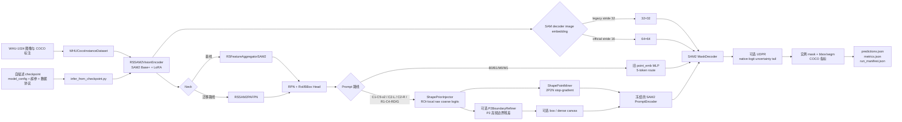

# Portable SAM2 Explicit Coarse：项目架构与文件指南

本文档是新派生项目的结构、接线和使用说明，也是后续代码变更的同步文档。
凡是新增、删除、重命名文件，或改变模型接线、配置参数、训练入口、数据协议、
实验矩阵和验证方式，都应在同一次改动中更新本文档。

## 1. 项目定位与边界

项目根目录：

```text
/home/wangcheng2021/project/new
```

项目包含三个明确隔离的区域：

- `portable_sam2_explicit_coarse/`：唯一的新主线实现和实验入口；
- `sam2/`：随项目固定的官方 SAM2 运行时源码，新主线通过 `SAM2_REPO` 使用；
- `legacy_baseline/`：旧项目冻结复现包，只用于历史基线复现，不被新主线 import。

新主线只保留已经选定的 PAFPN、显式 coarse mask、原生 PromptEncoder 加载，
以及实验性的 Gaussian dense 表示和 P2BoundaryRefiner。旧 DenseBR 已从当前代码删除；IIMR、多轮 mask
memory、topology token、SABL refined-box 依赖等不属于
新主线。

历史基线与新主线必须使用不同的输出目录，不能覆盖历史 checkpoint。

> 2026-09-07：为 VHR-10 P2-v2 A2（R1 `correction_keep`）新增纯遥测字段：纠错/错误/低置信/保持支持域比例及 corrective BCE、keep penalty；另在每 epoch 首个有效 batch 以与生产辅助损失相同的 DDP 归一化探测两项对 P2BR 的梯度 L2 与 cosine。统计与 probe 均不参与 forward、loss 或 optimizer step，也不改变 A1 已启动进程；详见 `DEBUG_FIELDS.md`。

## 2. 整体架构



### 2.1 两条 Prompt 路线

SAM2 MaskDecoder 的 image embedding 与 detector FPN 解耦选择：现有 B0/B1、M0/M1、C1–C5、C2-L 及 C2-R
保留旧基线 stride-32/32×32；R0/R1 从同一四层 FPN 选择 stride-16/64×64，符合
官方1024输入空间契约。Detector neck 在两种路线中都继续接收完整
256/128/64/32特征，不把分辨率消融混入 RPN/RoI 特征。R0/R1 的 high-res
features 自动对应256×256和128×128，MaskDecoder 原生输出为256×256；legacy
路线对应128×128和64×64，原生输出为128×128。

`prompt_sparse_mode="point"` 是旧基线桥接路线：

- 构造 `point_emb` MLP；
- 使用旧基线的64×64零初始化可训练 image positional embedding，并按当前
  MaskDecoder image embedding插值（B0/B1/M0/M1为32×32，R0为64×64）；
- 不构造 `PromptEncoder`；
- 不构造 `ShapePriorInjector`；
- 不构造 P2BoundaryRefiner。

B0/B1 保持历史 ROI-local final-mask target 与 bbox paste；M0/M1 复用完全相同的
MLP、legacy positional embedding、zero-init trainable no-mask embedding 和训练超参，
只把 `final_mask_coordinate_mode` 切为 `full_image`。因此 B0→M0、B1→M1 只测
final-mask 坐标契约，M0→C1、M1→C2 才是在相同 full-image 契约下比较 MLP/coarse。

`prompt_sparse_mode="shape_point"` 是显式 coarse 路线：

- 不构造旧 `point_emb` MLP；
- 由 `ShapePriorInjector` 产生 ROI-local coarse logits；
- 从 coarse logits 挖掘 2 个正点和 2 个负点；
- 按实验配置增加 box token、dense mask prompt 和 P2BoundaryRefiner；
- 使用相同型号 SAM2 checkpoint 加载原生 PromptEncoder；默认全部冻结，只有显式
  densefix-unfreeze 消融通过 `cfg.model` 解冻其中 4,684 个
  `mask_downscaling` 参数。
- 默认 `fusion_type="roi_only"`，RoI feature 直接进入 small coarse decoder，
  不构造全图 context、box encoding、cross-attention 或 FiLM gamma/beta 参数；
  `gated_spatial_film` 仅保留为后续显式消融。

### 2.2 coarse 与 P2BoundaryRefiner 接线

- coarse logits 默认大小为 `64×64`，坐标系是 ROI-local；
- 2P2N 挖掘对 coarse logits 使用 stop-gradient；默认按置信度、前景拓扑和点间距
  自适应判定每个点槽是否有效；薄前景和低置信背景有显式 fallback，并记录
  all-invalid ROI 比例；无效点槽在 PromptEncoder 后显式置零，整批全部无效时
  使用真正的空 sparse prompt，不注入四个学习到的 `not_a_point` token；
- `SHAPE_POINT_ADAPTIVE_VALIDITY=0` 是真正的固定有效 2P2N 对照，始终从概率极值
  生成四个空间互斥的点，不再受自适应有效性阈值控制；无法满足距离约束时显式失败；
- point warm-up 默认关闭；开启时训练和当轮 validation/EMA validation 都服从同一
  epoch 阶段，独立 checkpoint 推理默认使用完整2P2N；
- coarse BCE+Dice 默认使用固定权重 `0.10`；未经验证的 `0.20→0.10` epoch
  schedule 只保留为显式策略消融，不再是 C1-C5 隐式默认；
- dense prompt 会被粘贴到 full-image canvas；1024输入的legacy 32×32路线对应
  PromptEncoder `128×128` mask输入，官方64×64路线对应`256×256`；编码后的
  dense embedding delta 被 proposal-box support 限制，box 外保持 no-mask 基底；
- R1-C4-RD 将 raw-logit dense 输入显式 detach，作为 final-mask 梯度路径控制；
  R1-C4-G 在同样 detach 下将 dense 表示替换为 SAMRefiner 风格 hard-EDT
  Gaussian。后者在 ROI-local 64×64 coarse 上以0.5阈值求精确欧氏距离最大中心和
  全前景面积，再经 proposal 解析映射到 full-image 256×256 canvas，使用固定
  `omega=15,gamma=4` 的正值各向同性 Gaussian，不做 temperature、符号映射或
  clamp；精确EDT依赖训练环境中的`scipy.ndimage`；空 coarse ROI 在编码后逐实例
  恢复为预训练 no-mask 基底；
- dense 残差按 `base + alpha * (shape_dense - base)` 注入；训练器逐 epoch 汇总
  所有 DDP rank 的有效 `alpha`、注入前/后的 delta norm 及相对 base norm 的 ratio。
  `alpha` 非零只表示门已打开，`applied_delta_ratio` 非零才表示 coarse dense prompt
  实际改变了送入 MaskDecoder 的 dense embedding；
- C4 默认使用可学习 `global_sigmoid` 系数；C4-densefix 使用固定 `alpha=0.5`。
  densefix-unfreeze 在此基础上将
  `prompt_encoder_cfg.train_mask_downscaling=True` 写入 `cfg.model`，仅解冻
  PromptEncoder 的 mask convolution stack，并以独立 PromptEncoder LR 参数组训练。
  已完成的 stride-32 联合消融将 applied delta ratio 从约 0.146 提高到 0.307，
  但没有提升 segm mAP；该结果不能拆分固定门控和解冻 downscaling 的单独贡献；
- FiLM 默认关闭：`roi_only` 完全跳过 global visual context、RoI box encoding、
  cross-attention 和 gamma/beta heads。显式设置
  `SHAPE_CONTEXT_FUSION=gated_spatial_film` 时才构造这些模块；此时 global context
  固定二维8×8池化为64 tokens，并关闭未使用的 attention weights；
- `P2BoundaryRefiner` 仅在官方 stride-16 的 C5-v2 启用。它对完整 P2
  `detach()` 后做 `1×1+GN+GELU` 投影，再用与 prompt 完全相同的 `[N,5]` RoI
  进行 aligned avg RoIAlign 到 `32×32`；原 coarse 概率、不确定度和 raw-only
  搜索带作为额外 cue；
- forward 搜索带仅由 `sigmoid(raw.detach())` 产生：3×3 replicate 平滑、阈值
  `0.5`、边界膨胀半径 `4`。覆盖超过 ROI 的 50% 时整 ROI 残差关闭；GT 只参与
  auxiliary boundary loss support，绝不控制 forward；
- 残差为 `0.20 * 2.0 * tanh(.)`，因此逐像素绝对上界为 `0.4`；末端 `1×1`
  零初始化，使 C5-v2 初始输出与 R1-C4 严格恒等；
- raw coarse 继续承担 `0.10*(BCE+Dice)`；refined coarse 是 2P2N 和 dense canvas
  的唯一来源。新增 boundary BCE 权重 `0.05`，在每个 microbatch 上按全部 DDP rank 的有效
  ROI 全局均值归一化；该 auxiliary 使用 `raw.detach()+delta`，而最终 mask 路径
  使用 `raw+delta`，因此主 loss 同时训练 coarse head 和 refiner，P2 不接收该分支梯度；
- 冻结 PromptEncoder 参数时不使用 `torch.no_grad()`，最终 mask loss 仍能回传到
  coarse head 和 P2BoundaryRefiner。
- B0/B1 为复现历史结果，继续通过 `mask_target()` 使用 ROI-local target，并在
  validation/inference 中按 bbox paste。M0/M1、C1–C5 与 C2-L 的 SAM2 decoder 输出保留原生
  full-image 网格：训练直接对齐整图 GT，validation/inference 只 resize 到目标
  图像尺寸一次，不再按 bbox 二次粘贴。该模式保存在 `cfg.model` 和 checkpoint。
- B0/B1/M0/M1 的 `no_mask_embed` 对齐旧 MLP 基线：零初始化、可训练；C1-C5 和 C2-L 将
  SAM2 预训练 no-mask embedding 作为 PromptEncoder 路线的一部分加载并冻结。
  C1-C5 不允许缺失路径/key 时回退到全零：MaskHead 与 PromptEncoder 必须从同一
  checkpoint 得到完全一致的值，否则模型构建立即失败；INIT_FROM、RESUME、EMA
  和 checkpoint 推理加载后都会再次校验，拒绝旧的零值/漂移 checkpoint 静默覆盖。
- C2-L 保留 C2 的 full-image PromptEncoder/MaskDecoder 坐标和推理后处理，
  只改最终 mask 训练监督。每个 positive proposal 在 decoder 网格上扩张
  `1.20x`；ROI 内前景/背景 BCE 分别归一后等权平衡，再加入权重 `1.0`
  的 ROI Dice，ROI 外 BCE 仅以 `0.05` 抑制整图泄漏。proposal support 只参与
  loss weighting，不裁剪 image embedding，不改点坐标，validation/inference 不按框粘贴。
  该配置随 `cfg.model` 和 checkpoint 持久化，与原 C2 的 standard full-image CE
  保持独立架构 ID 与指纹。
- C2-R 是独立 ROI-SAM2 路线。每个 proposal 使用同一原始框对 32×32 image
  embedding 和 128×128/64×64 high-res features 做 aligned avg RoIAlign，并把
  各 crop 重采样回对应特征的原生空间大小；coarse 2P2N 经 canonical
  `[0,0,1024,1024]` 框映射为 ROI-local PromptEncoder 坐标。MaskDecoder 输出
  128×128 ROI-local mask，训练 target 使用同一 proposal crop 并直接保持
  128×128，不回落到历史 B0 的 28×28 target；validation/inference 再按检测框贴回
  整图。C2-R 不使用 box token、dense prompt、FiLM 或 P2BoundaryRefiner，且
  `roi_sam_cfg` 进入 `cfg.model`、架构指纹和 checkpoint。

## 3. 顶层目录与文件

| 路径 | 用途 |
|---|---|
| `README.md` | 项目概览、基线复现和新主线快速入口。 |
| `PROJECT_ARCHITECTURE.md` | 本文档；架构、逐文件说明和维护契约的事实来源。 |
| `DEBUG_FIELDS.md` | 训练机制日志字段字典；定义 latest-forward、DDP epoch 统计和 pathway gradient/update probe 的分母与判读。 |
| `portable_sam2_explicit_coarse/docs/whu_fi_dev_results_20260906.md` | WHU fi 开发结果台账：14 次训练曲线与证据路径；§0 补充 627 图评估的 P→PB→PBM 平均递增暂定结论、稳定性边界与 E14/末轮区别。 |
| `portable_sam2_explicit_coarse/docs/d5_review_handoff.md` | 2026-09-06 阶段诊断复审与跨-agent交接：核实证据边界、提出 P2-off 的 D5-A/B dense 适配及 PE 独立更新验收；属于待实施建议，不表示脚本已落地或训练已启动。 |
| `portable_sam2_explicit_coarse/docs/a0_two_site_oracle_design.md` | 以 NWPU A0 最佳权重为共同冻结底座的双位置 Oracle 设计：canvas 输入端的 GT-content×gate 格，与不加新 prompt token 的 SAM2 decoder-tail PointRend-style uncertainty-point 格；明确 GT 仅作 Oracle/训练 target，均尚未实现候选模型。 |
| `portable_sam2_explicit_coarse/docs/udpr_decoder_tail_design.md` | UDPR 独立 decoder-tail 实施契约：冻结 A0、无 GT selector 的 uncertainty Top-K、热启动白名单、日志和 paired-bootstrap 验收；不将 Oracle 上限写成模型收益。 |
| `C5_V2_METHOD.md` | C5-v2 论文方法设计文档；整理完整架构、张量数据流、ECPG/P2-BRR、损失与制图说明。 |
| `portable_sam2_explicit_coarse/docs/prompt_consumption_and_p2_refinement_implementation_guide.md` | Prompt 消费鲁棒化与 P2 边界提示的实施前指导；本轮在固定 WHU 10% train / 10% validation 上快速验证，P2 点细化须通过 real-P2 对 sham-P2 的信息门。 |
| `portable_sam2_explicit_coarse/docs/p2_point_refiner_design.md` | P2 点细化的历史候选设计；已降级，不能作为当前实施依据。 |
| `MIGRATION_MANIFEST.md` | 记录两个参考项目、选取内容、排除内容和复现规则。 |
| `.gitignore` | 顶层 Git 忽略规则。 |
| `scripts/verify_legacy_baseline.sh` | 校验冻结基线文件和 SHA256 完整性。 |
| `scripts/reproduce_legacy_bbox.sh` | 进入冻结包并复现历史 bbox 最强基线。 |
| `scripts/reproduce_legacy_segm.sh` | 进入冻结包并复现历史 segm 最强基线。 |
| `sam2/` | 固定的 SAM2 Python 包及 Hydra 配置；除明确升级 SAM2 外不要修改。 |
| `legacy_baseline/` | 冻结旧项目和完整性清单；不承载新功能。 |
| `portable_sam2_explicit_coarse/` | 新主线源码、配置、训练和消融入口。 |

## 4. 新主线逐文件说明

### 4.1 配置：`portable_sam2_explicit_coarse/configs/`

| 文件 | 用途 |
|---|---|
| `_sam2_registry.py` | 将 SAM2 型号映射到 checkpoint、Hydra YAML 和 neck 通道；解析 `SAM2_MODEL_SIZE`、`SAM2_CKPT`、`SAM2_REPO`。 |
| `environment.sh` | 已提交的机器环境默认配置；集中定义 Python、SAM2/权重、WHU 数据、输出根目录、临时目录及默认 GPU/batch。 |
| `environment.local.sh` | 可选、被 Git 忽略的单机覆盖文件；存在时由统一 loader 优先读取，避免迁移机器时改动已提交默认配置。 |
| `rsprompter_anchor_satS_v11_sam2_large_full.py` | 继承自旧项目的完整 MMEngine 基础配置，定义 detector、RPN、RoI head、优化相关默认值。 |
| `whu1024_baseplus_clean.py` | WHU-1024 / SAM2 Base+ 的干净桥接基线；通过 `NECK_TYPE` 切换 aggregator/PAFPN，默认使用旧 MLP prompt 路线。 |
| `whu1024_baseplus_explicit_coarse.py` | 显式 coarse 主配置；选择 points、points+box、points+box+dense，并解析可选 P2BoundaryRefiner。 |
| `whu1024_baseplus_explicit_coarse_densefix.py` | 继承显式 coarse 主配置，只覆盖固定 dense 系数，并按显式开关把 mask-downscaling trainability 解析进 `cfg.model`。 |

配置继承关系：

```text
rsprompter_anchor_satS_v11_sam2_large_full.py
└── whu1024_baseplus_clean.py
    └── whu1024_baseplus_explicit_coarse.py
        └── whu1024_baseplus_explicit_coarse_densefix.py
```

### 4.2 模型：`portable_sam2_explicit_coarse/rsprompter/`

| 文件 | 用途 |
|---|---|
| `__init__.py` | 注册 MMDetection 模型组件；`RSPROMPTER_LIGHT_IMPORT=1` 用于轻量张量测试。 |
| `anchor_detector.py` | `RSPrompterAnchor`：SAM2 特征抽取与 RPN/ROI 两阶段 loss/predict。 |
| `anchor_roi_head.py` | `RSPrompterAnchorRoIPromptHead`：prompt 构造、box jitter、ROI-local coarse/P2 监督接线、chunked mask forward。 |
| `sam2_vision.py` | SAM2 checkpoint 加载 helper、`RSSAM2PositionalEmbedding`、LoRA `RSSAM2VisionEncoder`、`_load_pretrained_no_mask_embedding`。 |
| `sam2_decoder.py` | `RSSAM2MaskDecoderWrapper`（SAM2 MaskDecoder 严格加载与前向）。 |
| `sam2_neck.py` | `RSFeatureAggregatorSAM2`（基线 aggregator）与 `RSSAM2PAFPN`。 |
| `sam2_mask_head.py` | `RSPrompterAnchorMaskHeadSAM2` 主体：配置布线（__init__）、因果链 forward、predict 与 no-mask 契约。 |
| `sam2_mask_head_helpers.py` | mask head 的 prompt canvas / ROI-SAM / debug 方法 mixin。 |
| `sam2_mask_head_targets.py` | mask head 的 GT targets 与 coarse/final-mask loss 方法 mixin。 |
| `models.py` / `models_sam2.py` / `shape_prior.py` | 兼容门面：纯再导出，外部 import 路径与注册表名不变（2026-09 拆分）。 |
| `shape_prior_injector.py` | `ShapePriorInjector` + SmallMaskDecoder + RoIBoxEncoding：coarse mask 生成。 |
| `shape_point_miner.py` | `ShapePointMiner`：自适应硬 2P2N 点挖掘（stop-gradient）。 |
| `coarse_mask_loss.py` | coarse mask 的 BCE、Dice、boundary、distance 组合损失及权重调度。 |
| `dense_prompt_utils.py` | raw/confidence coarse 变换、ROI-local mask 粘贴，以及 R1-C4-G 的 detached exact-EDT Gaussian 挖掘与图像空间映射。 |
| `p2_boundary_refiner.py` | C5-v2 的 P2 高频边界残差模块；实现 raw-only forward support、受限残差和 boundary auxiliary loss。 |
| `decoder_tail_refiner.py` | UDPR：在 SAM2 native logits 后按最小 `|logit|` 的确定性 Top-K 选点，以 decoder upscaled feature、mask token、logit/坐标预测局部残差；不读取 P2/coarse，GT 只用于训练 selected-point target。 |
| `architecture_contract.py` | 从完整解析后的 `cfg.model` 派生架构 ID、schema-v2 SHA256 指纹，并校验 INIT/RESUME。 |
| `ckpt_utils.py` | SAM2 子模块 checkpoint 的严格加载、key 过滤和主进程日志。 |

关键类的定位：

- `RSSAM2VisionEncoder`：SAM2 Base+ 图像编码器与 LoRA；
- `RSFeatureAggregatorSAM2`：旧 neck 对照；
- `RSSAM2PAFPN`：四层 SAM2 特征的 PAFPN；
- `RSPrompterAnchorMaskHeadSAM2`：决定走 MLP 还是显式 coarse；
- `ShapePriorInjector`：产生 coarse logits；
- `ShapePointMiner`：从 coarse logits 产生 2P2N；
- `P2BoundaryRefiner`：在 PromptEncoder 前只修正 raw coarse 的局部边界。

### 4.3 数据：`portable_sam2_explicit_coarse/data/`

| 文件 | 用途 |
|---|---|
| `__init__.py` | 导出 `create_train_loader`、`create_test_loader`。 |
| `loader.py` | 统一构造 train/validation DataLoader；实现独立、确定性的 train/val 子集抽样；仅支持 `whu_coco`/`vhr10_coco`。 |
| `whu_instance_dataset.py` | WHU 与 NWPU VHR-10 共用的 COCO 实例分割数据集实现。 |

旧 LabelMe 卫星数据集、UAV 双流数据集与 iSAID 支持面已于 2026-09 重构删除（commit 0fddc0a）。

WHU 默认路径：

```text
2.1 train/train
2.3 valid/validation
2.4 annotation/annotation/train.json
2.4 annotation/annotation/validation.json
```

训练器和 DataLoader API 的比例默认均为 `1.0`；消融运行器当前将
`TRAIN_SUBSET_RATIO` 默认设为 `0.2`，`VAL_SUBSET_RATIO` 默认保持 `1.0`，即
20% train / 100% validation。小于 1 时按图像级确定性抽样；训练使用
`SUBSET_SEED`，验证使用 `SUBSET_SEED + 10000`。

训练数据口径与 WHU1024 历史基线一致：无有效 GT 的训练 batch 仍进入 detector
loss，不做 rank-local 跳过。不同 DDP rank 的 `DistributedSampler` shard 可能包含不同数量的
空标注图像，因此任何只在单个 rank 生效的提前 `continue` 都会破坏 DDP collective
顺序；训练主循环必须保证所有 rank 每个 iteration 经过相同的 finite-check 和梯度
同步路径。

验证执行契约与 WHU1024 历史基线一致：

- validation batch size 默认固定为 `1`；
- DDP 时只有全局 rank 0 顺序遍历完整 validation，其他 rank 在独立的
  CPU/Gloo epoch-control broadcast 等待，不重复累计全分辨率预测 mask，也不让
  长时间 COCO 评估占住 NCCL collective；
- `VAL_EVERY_N_EPOCHS` 决定验证周期，公共消融入口保持默认 `1`，即每个 epoch
  都在 100% validation 上执行预测和 COCO bbox/segm 评估；
- 点筛公共入口默认 `COMPUTE_VAL_LOSS=0`，省去同一 validation batch 上额外的
  `model.loss(...)` 前向；这只令日志中的 `val=disabled`，不关闭预测、COCO 指标、
  best checkpoint 或 early stopping。训练器直接调用仍默认计算 validation loss，
  可用 `COMPUTE_VAL_LOSS=1` 恢复；
- validation 预测的 dense mask 在每张图完成后立即批量编码为 COCO RLE 并释放；
  mask 填充率在编码时累计，不再在 epoch 末将全部 mask 转成 float32 扫描。首轮
  validation 的 GT 同样编码为 RLE，并在后续 epoch 按确定性顺序复用；
- 启用 validation loss 时，无有效 GT 的图像只跳过 loss，但仍进入 COCO 评估以
  计入假阳性；
- `segm_score_mode` 是训练 validation 与 checkpoint 推理共用、随 `cfg.model`
  保存的排序契约；当前全部消融默认 `detector`，因此 bbox/segm 都使用 detector
  score 并共享同一 COCO detection 对象；显式 `mask_quality` 时只为 segm 构造
  quality-score COCO DT，bbox 仍使用 detector score；
- `mask_quality` 必须同时启用 quality head 且预测中真实存在 `mask_scores`；配置
  不完整或字段缺失时立即报错，不允许静默回退导致训练/推理指标口径分叉；
- bbox 主摘要和 best-bbox checkpoint 默认按旧基线的 `bbox/mAP`；
  `bbox/mAP_75` 仍作为详细指标输出，可用 `SAVE_BBOX_BEST_METRIC` 显式覆盖；
- segm 后处理按模型配置选择：B0/B1/C2-R 使用 ROI-local bbox paste，M0/M1、C1–C5 与 C2-L 使用
  full-image resize；独立推理复用完全相同的 `model.predict` 路径；
- validation 后执行 CUDA cache 和 Python GC 清理。

### 4.4 训练：`portable_sam2_explicit_coarse/train/`

| 文件 | 用途 |
|---|---|
| `__init__.py` | 训练包标记。 |
| `train_rsprompter_fusion.py` | DDP 训练主入口；负责配置构建、参数组、EMA、checkpoint、断点恢复、COCO bbox/segm 验证和子集参数。 |

训练器的 loss 前向必须经 DDP 包装模型而非直接调用 `.module`，使 reducer 参与反向同步；首次
optimizer update 后还会输出一次全参数跨-rank 同步审计。训练器并在每个 epoch 记录三类 prompt 机制诊断：dense residual 的 DDP forward 均值、P2BR 的
ROI/像素汇总与 raw→refined gain，以及每 rank 首个训练 batch 上仅由 `loss_mask` 产生的 dense/P2BR
gradient probe 与整 epoch 参数 update norm。字段、分母和 D1/D2 判读标准以根目录
`DEBUG_FIELDS.md` 为准；这些 probe 不含 coarse/P2 auxiliary loss，避免将辅助监督误判为最终
MaskDecoder 的有效消费。

常用 CLI：

- `--config`：MMEngine 配置；
- `--data-root`、`--use-whu-coco`：WHU 数据入口；
- `--train-subset-ratio`、`--val-subset-ratio`：独立子集；
- `--init-from`：只加载模型权重开始新实验；
- `--resume-from`：恢复模型、优化器、epoch 等完整训练状态；
- `--max-train-batches`、`--max-val-batches`：快速 smoke；
- `--val-batch-size`：验证 batch size，默认 `1`，保持 WHU1024 历史基线口径；
- `--val-every-n-epochs`：验证周期，默认 `1`；
- `--compute-val-loss {0,1}`：是否在预测之外额外执行 validation loss 前向；训练器
  默认 `1`，公共点筛 runner 默认传入 `0`；
- `--shape-prior-lr-mult`、`--p2-boundary-refiner-lr-mult`：新模块学习率倍率；
- `--allow-cross-arch-init`：仅用于明确的跨架构/旧权重初始化，默认关闭；resume
  始终要求架构 ID 和完整模型指纹一致。

训练器和全部 B0/B1、M0/M1、C1–C5、C2-L、C2-R 消融 wrapper 的公共优化默认值对齐 WHU1024 历史最强基线：
默认使用物理 GPU `1,2` 的两卡 DDP；每卡 batch `1`、梯度累积 `4`、有效全局
batch `8`、基础 LR `5e-4`、backbone
与其余主干倍率 `1.0`、mask decoder/no-mask 倍率 `1.0`、weight decay `0.05`、
warmup `100` optimizer steps。点筛公共入口默认 `EMA_ENABLED=0`、`EMA_EVAL=0`、
`EMA_SAVE_BEST=0`，避免短子集阶段在 epoch 5 切换到尚未成熟的 EMA 权重；完整数据
EMA 实验须显式设置 `EMA_ENABLED=1`，其余两个开关默认随之开启。
当前训练器的 cosine `T_max` 按真实 optimizer steps 计算。冻结旧基准则按
mini-batches 计算 `T_max`、但只在梯度累积后的 optimizer update 调度一次；当
`GRAD_ACCUM_STEPS=2` 时旧 cosine 实际衰减约慢一倍。因此 20% 点筛 B0 用于矩阵内部
公平比较和接线趋势核验，不应被描述为旧基准完整 LR 曲线或最终指标的严格复现。
detector loss在全部epoch保持权重`1.0`；阶段边界仍归档，但默认不再在epoch 6/11
静默降为`0.75/0.50`。最终mask训练同时记录ROI target fill、logit均值/方差、概率
均值和阈值前景率，便于第一轮识别整图target或全空mask回归。
early stopping 使用 segm mAP、平滑窗 `5`、patience `10`、epoch `20` 前不计数、
min delta `5e-4`。这些值由公共运行器统一传入，所有架构消融默认一致。
训练 NCCL process-group timeout 由公共运行器统一设置为 `1800` 秒；rank 0 完整
validation 与 COCO bbox/segm 评估后的 epoch 控制改走独立 CPU/Gloo group，默认
timeout `86400` 秒。最外围分别用 `TORCH_DDP_TIMEOUT_SECONDS` 与
`TORCH_DDP_CONTROL_TIMEOUT_SECONDS` 覆盖；兼容旧变量 `NCCL_TIMEOUT` 只作为
训练 NCCL timeout 的次级回退。每个 worker 在初始化 NCCL 前先绑定自己的 CUDA
device，避免所有进程初始化阶段暂时落到 GPU0。

新 checkpoint schema version 为 `2`，其中 `config_snapshot` 保存：

- 完整解析后的 `model_config`；
- 完整 `training_args`；
- validation/test 数据路径、图像尺寸和类别协议；
- SAM2 repo、checkpoint 和型号；
- Prompt 路线、neck、P2BoundaryRefiner、训练计划及学习率倍率；
- dense gate 模式以及 PromptEncoder `mask_downscaling` 的 trainability；
- 由解析后 `cfg.model` 派生的 `architecture_id` 与完整 SHA256 指纹；本机 SAM2
  checkpoint 路径不参与架构指纹，避免仅路径变化造成假不一致。

恢复旧 checkpoint 续训时会保留旧实验记录，并补入新 schema 中缺失的字段。

### 4.5 推理：`portable_sam2_explicit_coarse/inference/`

| 文件 | 用途 |
|---|---|
| `__init__.py` | checkpoint 推理包标记。 |
| `infer_from_checkpoint.py` | 读取指定 checkpoint，恢复自描述模型配置，严格加载 model/EMA 权重，在 WHU、VHR-10 validation、test 或自定义 COCO split 上推理与评估；`--export-bootstrap-records` 同时导出同一模型空间的 GT/DT/images 供 paired bootstrap。 |

推理默认使用 `checkpoint["model"]`。`--weights ema` 可显式读取
`checkpoint["ema_state"]["ema_state"]`；训练产生的 best checkpoint 在启用 EMA
评估时，其 `model` 本身已经是当轮用于验证的权重。

新 checkpoint 不需要额外 `.py` 配置。旧 checkpoint 缺少
`config_snapshot.model_config` 时可通过 `--config` 回退。模型构建仍需要项目内
SAM2 Python 包和对应 Base+ 预训练 checkpoint；路径可通过 `--sam2-repo`、
`--sam2-ckpt` 覆盖。

推理调用与训练验证相同的 `model.predict(..., rescale=False)`。MaskHead 根据
checkpoint 中的 `final_mask_coordinate_mode` 选择 ROI-local bbox paste 或
full-image resize；validation、test 和 custom split 同步生效，不维护第二套推理
实现。manifest 对应记录 `roi_local_bbox_paste` 或 `full_image_resize`。
同一 MaskHead 的 `segm_score_mode` 同时决定训练 validation 和独立推理的 segm
COCO 排序键；推理 manifest 记录 `bbox_score_key`、`segm_score_key` 与模式。旧
checkpoint 缺少该字段时由构造函数按历史口径解析为 `detector`。

#### 推理支持范围与参数持久化契约

当前 B0/B1、M0/M1、C1–C5、C2-L、C2-R 全部消融路线都支持 checkpoint 驱动推理，包括
aggregator/PAFPN、MLP/coarse、points、box、dense prompt 和 P2BoundaryRefiner。推理器不按
实验名称猜测结构，而是读取 checkpoint 中已经解析完成的 `model_config` 构建
模型，并以 `strict=True` 加载权重。旧 checkpoint 仅在 DenseBR 明确关闭且不含
DenseBR 参数时迁移为 `P2BoundaryRefiner(enabled=False)`；旧 DenseBR 开启权重会
被明确拒绝，避免将两种不同设计静默混用。

后续新增参数必须遵守以下归档规则：

| 参数类型 | 必须进入的位置 | 说明 |
|---|---|---|
| 影响模型结构、模块开关、张量形状或 forward/predict 行为 | `cfg.model` | 强制要求；checkpoint 中的 `model_config` 是推理重建的唯一模型事实来源。 |
| 训练优化参数，如学习率、epoch、梯度累积 | `training_args` | 由完整 `vars(args)` 自动保存；若同时影响模型推理行为，也必须进入 `cfg.model`。 |
| 数据路径、split、图像尺寸、类别映射、预处理 | `data_config` | 供推理器重建测试集；其中会改变模型结构的尺寸还必须同步进入 `cfg.model`。 |
| SAM2 repo、基础 checkpoint、型号等外部依赖 | `runtime_config` | 记录默认解析值，并允许推理 CLI 显式覆盖。 |
| 评估阈值、输出或 evaluator 行为 | 推理 CLI 或后续 `inference_config` | 不得通过未记录的临时环境变量改变正式评估口径。 |

禁止只在 shell 环境变量或训练代码局部变量中增加影响模型行为的参数。环境变量可
作为实验入口，但配置文件必须把它解析进 `cfg.model`，然后才能构建模型和保存
checkpoint。训练脚本、推理脚本都不得根据 checkpoint 文件名反推实验结构。

每次新增模型参数时必须同时完成：

1. 在相应 MMEngine 配置中给出明确默认值，并写入 `cfg.model`；
2. 在目标模型类构造函数中接收并校验该参数；
3. 确认训练保存的 `config_snapshot.model_config` 包含解析后的实际值；
4. 使用 `--build-only` 对新 checkpoint 做严格 round-trip，要求 missing 和
   unexpected keys 均为 0；
5. 若旧 checkpoint 无法兼容，提升 `checkpoint_schema_version` 并提供明确迁移或
   `--config` 回退策略；
6. 同步本文档的架构、文件用途、参数和推理支持说明。

### 4.6 运行脚本：`portable_sam2_explicit_coarse/scripts/`

| 文件 | 用途 |
|---|---|
| `run_whu1024_explicit_coarse_4gpu.sh` | 保留的历史文件名；当前实际复用公共 runner 的两卡 GPU 1/2 默认值，并按 prompt/refiner/stride 映射路线；可显式覆盖回四卡。 |
| `load_environment.sh` | shell 环境统一加载器；优先读取被忽略的 `configs/environment.local.sh`，否则读取 `configs/environment.sh`，并支持 `PORTABLE_SAM2_ENV_FILE` 显式指定。 |
| `infer_whu_checkpoint.sh` | 指定 checkpoint 的单卡推理 shell 入口；其余参数透传给 Python 推理器。 |
| `infer_whu_checkpoint.sh` | 指定 checkpoint 的单卡推理 shell 入口；其余参数透传给 Python 推理器。 |
| `_run_ablation.sh` | WHU 消融共享受控运行器（仅 coarse 路由；历史 mlp 路由已删）；固定架构变量、校验契约、记录超参、组装 torchrun，默认 `nohup setsid` 后台运行。 |
| `_run_vhr10.sh` | VHR-10 共享运行器：5 个变体（fast400/jitter400/large400/large600/ft200）薄入口共用；架构 exports 单一事实源（C4 事故教训）。 |

`scripts/ablations/`（薄入口与 eval wrapper）：

| 文件 | 用途 |
|---|---|
| `README.md` | 消融矩阵、子集、dry-run、VHR-10 入口与目录地图。 |
| `whu_p2_matrix_common.sh` | 四行矩阵共享的近期 WHU fast 协议：4 GPU、AMP、150 epoch、全量 WHU、ROI-local、stride-16 和相同增强。 |
| `whu_p2_matrix_point.sh` | 仅 2P2N points 的矩阵首行。 |
| `whu_p2_matrix_point_box.sh` | points + box 的矩阵第二行。 |
| `whu_p2_matrix_point_box_mask.sh` | points + box + raw-logit dense mask 的矩阵第三行。 |
| `whu_p2_matrix_full.sh` | 仅在第三行基础上启用 P2BoundaryRefiner 的完整矩阵行。 |
| `whu_d1_dense_dev_10p_2gpu.sh` | D1 两臂短程开发：points+box 对 points+box+dense；固定两卡、有效全局 batch 8、WHU 10%/10%、15 epoch。 |
| `whu_d2_p2_dev_10p_2gpu.sh` | D2 两臂短程开发：冻结 dense 后比较 Mask 对 Full；固定两卡、有效全局 batch 8、WHU 10%/10%、15 epoch。 |
| `whu_fullimage_overlay.sh` | full_image 空间契约 overlay（`FINAL_MASK_COORDINATE_MODE=full_image` + `FINAL_MASK_LOSS_MODE=roi_balanced_dice`），供下列 whu_fi_* 在调用行 wrapper 前 source。roi_balanced_dice 是该协议的组成部分——稀疏前景下全画布标准 BCE 会塌缩到全背景捷径（git 6dc6aa4）——不是超参扫参。 |
| `whu_fi_matrix_full_data.sh` | 四行矩阵的 full_image 契约版：协议旋钮全部继承 `whu_p2_matrix_common.sh` 默认（4 GPU、150 epoch、全量 WHU、EMA），仅坐标/loss 契约不同；行序 Point→+Box→+Mask→Full。 |
| `whu_fi_d1_dense_10p_2gpu.sh` / `whu_fi_d2_p2_10p_2gpu.sh` | D1/D2 的 full_image 契约版：除契约两字段外与 roi_local D 系列 dev 协议逐项一致（DRY_RUN resolved-Hyperparameters 逐字段差分核验通过，仅 run_tag/坐标/loss 三处不同）；`whu_d1fi_*` / `whu_d2fi_*` run tag 与旧结果隔离。 |
| `whu_fi_d3_p2esc_10p_2gpu.sh` / `whu_fi_d4_csig_10p_2gpu.sh` | D3（P2 包络 ±0.30 组合配方）/ D4（csig 画布）dev 臂；设计 `docs/d3_d4_p2_escalation_canvas_design.md`（v3）。 |
| `whu_fi_d5a_mask_gate050_10p_2gpu.sh` / `whu_fi_d5b_mask_gate050_pe010_10p_2gpu.sh` | D5 两臂（门控初值 0.5 对照 / +PE mask_downscaling 适配）；方案 `docs/d5_review_handoff.md`；协议硬锁。 |
| `whu_fi_d6_pb_control_10p_2gpu.sh` / `whu_fi_d6_mask_gate010_pe010_10p_2gpu.sh` / `whu_fi_d0_point_10p_2gpu.sh` | D6（PB 对照复跑 + 小门 α0.1×PE 适配候选）与 D0（fi 契约 Point-only 首跑）。 |
| `tools/eval_existing_runs.py` / `tools/chain_fulleval_probe.py` | 现有权重的统一全量评估（7 臂×best/末轮；fcntl 运行锁防双调度器；陈旧输出自动清理）与批次→补跑→提示开关探针的自动链（失败传播，14/14 校验）。 |
| `paper_promptminer_rd_p2_whu_full_fast.sh` | WHU fast-150 论文运行入口（test segm/mAP 0.7342）。 |
| `test_only_from_ckpt.sh` | 给定 checkpoint 仅做 test 评估。 |
| `vhr10_fast400.sh` 等 5 个 | VHR-10 薄入口，见 `scripts/_run_vhr10.sh`。 |
| `vhr10_p2v2_dev.sh` / `vhr10_p2v2_dev_series.sh` / `vhr10_p2v2_eval.sh` | NWPU A 系列的 A0/A1/A2/A3 100ep 受控训练、串行总入口与 strict post-run 评估入口：全量 520/130、4 卡、fi、raw 选型、E100 显式保存；series 任一臂失败即停止，传 arm 参数可只追加新臂。评估从 checkpoint 重放 VHR-10 10 类契约并导出 bootstrap records。A0 固定 D5-B；A1/A2 是 P2 轴；A3 仅加入零初始化 UDPR-K64、单阶段端到端训练。 |
| `vhr10_udpr_k64.sh` | NWPU 独立 UDPR-K64 热启动入口：从固定 A0 best 权重跨架构初始化，强制只训练 decoder tail；不属于 P2-v2 A0/A1/A2 主线。 |
| `queue_vhr10_a2_a3.sh` | 本地持久队列：仅在 GPU 0–3 均无 compute PID 后，经 A2/A3 DRY_RUN 再严格前台串行启动 `a2 a3`；`flock` 防止同一 checkpoint 目录的重复队列。A2 明确为默认 R1，非 A2e。 |
| `eval_test_raw.sh` / `eval_test_winner.sh` / `eval_vhr10_final.sh` | checkpoint 的 raw/EMA 评估 wrapper。 |

`scripts/smoke/`：

| 文件 | 用途 |
|---|---|
| `smoke_test_components.sh` | 启动轻量组件测试（实现在 `tools/smoke_test_components.py`）。 |
| `validate_ablation_contract.py` | 校验解析后配置、真实数据子集和可选完整模型实例是否与脚本声明一致。 |
| `smoke_ddp_control_plane.py` | DDP 控制面广播单测。 |
| `test_dense_prompt_utils.py` | 检查 raw detach、Gaussian 中心/面积映射、各向同性、空 coarse 和不可导契约。 |
| `check_forward_equivalence.py` | 黄金前向等价校验：从 checkpoint `model` 权重（非 EMA）重建模型，逐位比对 state_dict 与固定输入前向输出（2026-09 重构回归门）。 |
| `test_decoder_tail_refiner.py` | UDPR 张量回归：零初始化恒等、stable tie-break 与 selected-point BCE 对末层参数的非零梯度。 |
| `test_decoder_tail_ddp_empty_rank.py` | CPU/Gloo 双 rank 回归：一张 rank 无正 RoI 时仍与有 RoI rank 对齐 UDPR 的两次 BCE collective，且二者得到相同 global-BCE telemetry。 |
| `check_udpr_a0_equivalence.py` | 用真实验证 batch 依次重建 A0 与零初始化 UDPR，严格核验 A0 load、UDPR heat-init missing-key 白名单及最终 bbox/label/score/mask prediction SHA256 恒等。 |

### 4.7 工具与通用函数

| 文件 | 用途 |
|---|---|
| `tools/mask_to_coco_whu512.py` | 将 WHU 二值 mask 转为 COCO polygon 标注；属于数据准备工具，不是训练必需步骤。 |
| `tools/eval_boundary_ap.py` / `tools/eval_vhr10_original_scale.py` / `tools/visualize_instances.py` / `tools/smoke_test_components.py` | 评估与可视化工具。 |
| `inference/probes/canvas_accuracy_probe.py` | 冻结 checkpoint 的 dense-canvas 信息质量与消费敏感性探针：按推理期 IoU 匹配实例 GT，在全图 PE canvas 上测 learned→GT logit 混合，并交叉 `current/forced alpha`；先以 unhooked 标准推理逐图 hash 断言 `blend=0,current` 逐位一致，再要求所有画布干预保持检测输出不变。`blend=1,alpha=1` 是 GT 画布与全开 gate 的定位格，不是可部署模型或训练消融。 |
| `inference/probes/`（其余） | 审计探针（通路审计、P2 oracle、E0、点可学性、P2 可视化），手动调用；P2 通路审计结论见 `docs/p2_decoder_side_findings.md`。 |
| `utils/__init__.py` | 通用工具包标记。 |
| `utils/coco_eval_utils.py` | 构造 COCO GT/DT 并执行 bbox/segm COCOeval；支持 bbox score 和 mask score 两种评估分数。 |
| `.gitignore` | 忽略本地缓存、运行产物等。 |

### 4.8 运行产物

`${PORTABLE_SAM2_LOG_ROOT}/ablations/` 是当前 B0/B1、M0/M1、C1–C5、C2-L、C2-R 消融运行器的默认
日志目录。每次真实训练只生成独立 `.log`，不生成 `.pid`；`DRY_RUN=1` 的参数穿透、
数据检查和模型构建 smoke 只输出到调用终端，忽略 `LOG_DIR`/`LOG_FILE`，不创建日志文件。
默认后台模式下，
终端只显示启动摘要、后台 PID 和日志路径，后续 stdout/stderr 仅落盘；
`RUN_IN_BACKGROUND=0` 时才持续同步显示在终端。日志
开头的 `resolved_hyperparameters_begin/end` 块记录解析后的架构路线、数据比例、
优化器、EMA、初始化/续训、有效全局 batch size、git commit 和精确 torchrun
命令。最外层脚本接受 `--master-port <port>` 或 `--master-port=<port>`；端口优先级为
命令行、`MASTER_PORT` 环境变量、按启动 PID 自动派生，避免并发后台实验都抢占旧默认
`29500`。全部入口共享 1800 秒训练 NCCL timeout 与 86400 秒 CPU/Gloo 控制
timeout。端口、两层 timeout 及 backend 均写入快照；timeout 也归档在 checkpoint
的 `runtime_config` 中。`RUN_SUFFIX` 可给整轮重跑统一追加隔离后缀，不改变各实验 ID。
使用 dense prompt 的实验每个 epoch 还会固定输出
`dense residual monitor: alpha=... source_delta_norm=... applied_delta_norm=...
source_delta_ratio=... applied_delta_ratio=...`。这些值跨 DDP rank 聚合，不依赖
`PROMPT_DEBUG_STATS`；若启用该开关，周期性 `[DEBUG-DENSE]` 日志也会输出同一组
最近一次前向值以及 canvas/base/shape/final 统计。B0、C1-C3 等未启用 dense prompt
的路线不会伪造该日志行。
`logs/` 下其余目录保留历史运行日志和 `.params` 快照，均不是模型源码。

新的 checkpoint 默认写到 `${PORTABLE_SAM2_CHECKPOINT_ROOT}/`，当前机器配置解析为
`/data/wangcheng/checkpoint/portable_sam2_explicit_coarse/`；不应提交
checkpoint、临时日志、`__pycache__` 或数据集；项目内 `logs/` 已由 Git 忽略。
本次语义修复后的 C1–C5、R1 和 coarse-strategy wrapper 默认 run tag 包含
`_semanticfix_roi_only`，主线全量入口的默认 checkpoint 目录也包含该后缀，避免与
修复前坐标/点策略及旧 FiLM checkpoint 混写。显式开启 FiLM 时自动改为
`_semanticfix_gated_spatial_film`；显式设置 `RUN_TAG`/`CHECKPOINT_DIR` 时仍以用户值为准。

推理默认在 checkpoint 同级创建 `inference_<split>/`：

- `predictions.json`：带 bbox、score、mask score 和 COCO RLE mask 的预测；
- `metrics.json`：有标注测试集上的 bbox/segm COCO 指标；
- `run_manifest.json`：checkpoint、配置来源、严格加载结果、数据协议和输出摘要。

## 5. 常用操作

所有新主线命令从以下目录执行：

```bash
cd /home/wangcheng2021/project/new/portable_sam2_explicit_coarse
```

迁移到另一台机器时，复制默认配置为被 Git 忽略的本机配置后修改：

```bash
cp configs/environment.sh configs/environment.local.sh
vim configs/environment.local.sh
```

需要保留仓库内默认文件不变时，也可使用外置配置：

```bash
PORTABLE_SAM2_ENV_FILE=/absolute/path/to/environment.sh \
bash scripts/ablations/whu_p2_matrix_point.sh
```

外层已经导出的同名变量优先于配置文件中的默认值，仍支持单次实验覆盖。

组件 smoke：

```bash
bash scripts/smoke/smoke_test_components.sh
```

当前 P2 路径矩阵默认使用最近的完整 WHU fast 协议。四行固定 PAFPN、stride-16、
ROI-local、AMP、4 GPU、有效全局 batch 8、全量 WHU、相同增强、seed 44 和 150 epoch；
唯一递增变量是 points、box、dense mask、P2BoundaryRefiner。dense 行默认
`SHAPE_DENSE_DETACH=0`，让 final-mask loss 训练现有 coarse/P2 路径。正式运行应串行：

```bash
RUN_IN_BACKGROUND=0 bash scripts/ablations/whu_p2_matrix_point.sh
RUN_IN_BACKGROUND=0 bash scripts/ablations/whu_p2_matrix_point_box.sh
RUN_IN_BACKGROUND=0 bash scripts/ablations/whu_p2_matrix_point_box_mask.sh
RUN_IN_BACKGROUND=0 bash scripts/ablations/whu_p2_matrix_full.sh
```

正式四行矩阵前必须先完成两段开发门：D1 仅比较 points+box 与 points+box+dense，使 dense
在 `SHAPE_DENSE_DETACH=0` 下形成正向最终分割趋势；D2 在 D1 参数冻结后仅比较 dense 与
Full，使 P2BR 的 refined coarse 不系统性差于 raw coarse 且 Full 呈正向最终分割趋势。两段均使用
固定 WHU 10% train / 10% validation、seed 44、GPU 1,2 两卡 AMP、每卡 batch 1 / accum 4（有效
全局 batch 8）、15 epoch、每 3 epoch validation 与 EMA-off；只允许调整当前已有的 dense/P2BR
控制参数，不新增模块。未通过门的组件不得写入论文
主矩阵；通过后才以冻结参数运行上述全量 150 epoch 四行消融。

两个开发脚本默认使用物理 GPU `1,2`，`NPROC_PER_NODE=2`、每卡 batch 1 与
`GRAD_ACCUM_STEPS=4`，故有效全局 batch 保持正式四卡矩阵的 8，不改变 LR、warm-up、优化器
或数据增强。D1 固定第一候选为 raw-logit、`detach=0`、dense alpha 初值 0.10、temperature 1.0；
D2 复用 D1 的 dense 值，并用既有 P2BR 的 `beta=0.10`、`delta_logit_max=0.50`、boundary loss
weight 0.05 作为保守第一候选。`P2_BOUNDARY_REFINER_BETA`、dense alpha 初值与 dense temperature
均由公共 runner 记录到启动快照，保证筛选可追溯。

VHR-10 实验（共享 runner，5 变体薄入口）：

```bash
bash scripts/ablations/vhr10_fast400.sh
RESUME_FROM=/data/.../last_checkpoint.pth bash scripts/ablations/vhr10_large600.sh
```

该命令会在终端打印实际日志文件路径，并默认写入
`logs/ablations/<run_tag>_<subset_tag>_<timestamp>_pid<pid>.log`。训练默认在后台
运行，命令返回不代表训练结束；使用启动时打印的日志路径和 `background_pid` 跟踪，
运行器不保存 PID 文件。需要外置日志时
可设置 `LOG_DIR`，需要固定文件名时可设置 `LOG_FILE`。

并行实验从最外层脚本指定不同端口：

```bash
bash scripts/ablations/whu_p2_matrix_point.sh --master-port=29602
bash scripts/ablations/whu_p2_matrix_point_box.sh --master-port=29603
```

前台调试：

```bash
RUN_IN_BACKGROUND=0 bash scripts/ablations/whu_p2_matrix_point.sh
```

显式启动完整数据实验：

```bash
TRAIN_SUBSET_RATIO=1.0 VAL_SUBSET_RATIO=1.0 \
  bash scripts/ablations/whu_p2_matrix_full.sh
```

只解析和核验，不训练：

```bash
DRY_RUN=1 CHECK_DATA=1 PREFLIGHT_MODEL=1 \
  bash scripts/ablations/whu_p2_matrix_full.sh
```

从 checkpoint 在完整 validation 上推理：

```bash
bash scripts/infer_whu_checkpoint.sh /path/to/best_model.pth
```

在 WHU test split 上推理：

```bash
bash scripts/infer_whu_checkpoint.sh /path/to/best_model.pth --split test
```

自定义 COCO 测试集：

```bash
bash scripts/infer_whu_checkpoint.sh /path/to/best_model.pth \
  --split custom \
  --data-root /path/to/dataset \
  --ann-file annotations/test.json \
  --image-subdir test/images
```

只查看 checkpoint 元数据或只验证模型重建：

```bash
bash scripts/infer_whu_checkpoint.sh /path/to/model.pth --inspect-only
bash scripts/infer_whu_checkpoint.sh /path/to/model.pth --build-only --device cpu
```

复现冻结历史基线：

```bash
cd /home/wangcheng2021/project/new
bash scripts/verify_legacy_baseline.sh
bash scripts/reproduce_legacy_segm.sh
```

## 6. 主要环境变量

下表中的机器相关默认值集中定义于 `configs/environment.sh`。消融、主线训练、推理、
组件 smoke、串行监视器以及顶层 legacy reproduction 代理均通过
`scripts/load_environment.sh` 加载；冻结包内部脚本和 vendored SAM2 不被修改。

| 变量 | 默认值/含义 |
|---|---|
| `PORTABLE_SAM2_ENV_FILE` | 可选的显式机器配置路径；未设置时优先读取 `configs/environment.local.sh`，不存在则读取已提交的 `configs/environment.sh`。 |
| `PYTHON` | Python 解释器路径；当前配置为 `/data/wangcheng/envs/cvt2/bin/python`。 |
| `SAM2_REPO` | 项目内 `../sam2`。 |
| `SAM2_CKPT` | `/data/wangcheng/pretrained-models/sam2/sam2_hiera_base_plus.pt`。 |
| `WHU1024_DATA_ROOT` | `/data/wangcheng/dataset/WHU`。 |
| `PORTABLE_SAM2_CHECKPOINT_ROOT` | 所有新主线与 legacy reproduction checkpoint 的公共根目录。 |
| `PORTABLE_SAM2_LOG_ROOT` | 训练和监视器日志根目录；默认 `<新主线>/logs`。 |
| `PORTABLE_SAM2_TMP_ROOT` | smoke sentinel、监视器锁等临时文件根目录。 |
| `MPLCONFIGDIR` | matplotlib 可写配置目录；默认位于 `PORTABLE_SAM2_TMP_ROOT`。 |
| `NECK_TYPE` | `aggregator` 或 `pafpn`；消融 wrapper 会固定。 |
| `EXPLICIT_PROMPT_MODE` | `points`、`points_box` 或 `points_box_dense`。 |
| `CONFIG_OVERRIDE` | coarse wrapper 的可选配置变体路径；默认仍为显式 coarse 主配置，densefix wrappers 固定选择 densefix 子配置。 |
| `FINAL_MASK_COORDINATE_MODE` | 最终 mask 坐标契约，默认 `roi_local`；MLP clean config 的公共 wrapper 将 B0/B1/R0 固定为 `roi_local`、M0/M1 固定为 `full_image`，C2-R 固定为 `roi_local`。四行矩阵 common 行自 2026-09 起可被外部覆盖（默认仍 `roi_local`，旧行为不变）；`whu_fi_*` 空间契约修正协议经 `whu_fullimage_overlay.sh` 固定为 `full_image`。解析进 `cfg.model` 和 checkpoint，推理端自动选择 `roi_local_bbox_paste` 或 `full_image_resize`。 |
| `FINAL_MASK_LOSS_MODE` | 最终 mask 监督；默认 `standard`，C2-L 与 `whu_fi_*` 空间契约协议固定为 `roi_balanced_dice`（后者必须配 `full_image`，头部构造函数强制校验）。仅改训练 loss，不改 full-image 验证/推理后处理。 |
| `FINAL_MASK_ROI_EXPAND_RATIO` | C2-L proposal loss support 扩张倍率，默认 `1.20`。 |
| `FINAL_MASK_ROI_BCE_WEIGHT` / `FINAL_MASK_ROI_DICE_WEIGHT` | C2-L ROI 内平衡 BCE 与 Dice 权重，默认 `1.0/1.0`。 |
| `FINAL_MASK_OUTSIDE_BCE_WEIGHT` | C2-L ROI 外背景约束权重，默认 `0.05`。 |
| `ROI_SAM_ENABLED` | 默认 `0`；仅 C2-R wrapper 固定为 `1`。启用后裁剪三层 SAM2 特征、使用 ROI-local PromptEncoder 坐标和 ROI-local final-mask 契约。 |
| `ROI_SAM_SAMPLING_RATIO` | C2-R 三层 aligned RoIAlign 的每 bin 采样数，默认 `2`；解析进 `cfg.model.roi_sam_cfg`。 |
| `P2_BOUNDARY_REFINER_ENABLED` | `0/1`；仅 C5-v2 wrapper 固定为 `1`。 |
| `SHAPE_CONTEXT_FUSION` | coarse feature fusion；默认 `roi_only`，完全不构造 FiLM/context 参数；后续显式消融可设为 `gated_spatial_film`，`legacy_multiplicative` 仅作兼容对照。解析进 `cfg.model` 和 checkpoint。 |
| `P2_BOUNDARY_REFINER_PROJECTED_CHANNELS` / `P2_BOUNDARY_REFINER_MID_CHANNELS` | P2投影/融合通道，默认 `64/64`。 |
| `P2_BOUNDARY_REFINER_DELTA_LOGIT_MAX` | `tanh` 前残差幅度，默认 `2.0`；固定 beta `0.20` 后实际上界 `0.4`。 |
| `P2_BOUNDARY_REFINER_LOSS_WEIGHT` | 边界 BCE 权重，默认 `0.05`。 |
| `P2_BOUNDARY_REFINER_LR_MULT` | refiner 独立参数组学习率倍率，默认 `1.0`，weight decay 继承 `0.05`。 |
| `DECODER_TAIL_REFINER_ENABLED` | 默认 `0`；仅 UDPR 独立路线设为 `1`，此时解析其 `NUM_POINTS/HIDDEN_DIM/POINT_LOSS_WEIGHT/DELTA_LOGIT_MAX` 至 `cfg.model` 与新架构指纹。关闭时不写入模型配置，以保持历史 A0/P2 架构键不变。 |
| `DECODER_TAIL_LR_MULT` | UDPR 参数组 LR 倍率，默认 `1.0`；仅 `--train-decoder-tail-only` 路线使用。 |
| `SAM_IMAGE_EMBED_STRIDE` | SAM2 MaskDecoder image embedding步长；B0/B1、M0/M1、C1–C4默认`32`，R0、R1-C3、R1-C4、C5-v2固定`16`。 |
| `SHAPE_POINT_ADAPTIVE_VALIDITY` | `1` 默认自适应点槽有效性；`0` 固定输出有效 2P2N 极值点。 |
| `SHAPE_DENSE_TRANSFORM` | dense表示；默认`raw_logits`，R1-C4-G固定`gaussian_edt`。 |
| `SHAPE_DENSE_DETACH` | dense输入是否从coarse计算图detach；默认`0`，RD/G固定`1`。 |
| `SHAPE_GAUSSIAN_FOREGROUND_THRESHOLD` | G的hard coarse阈值，固定`0.5`。 |
| `SHAPE_GAUSSIAN_OMEGA` / `SHAPE_GAUSSIAN_GAMMA` | G的幅值/面积展宽常数，固定`15.0/4.0`。 |
| `POINT_WARMUP_ENABLED` | 默认 `0`；若开启，阶段长度由三个 `POINT_WARMUP_*` 变量定义。 |
| `SHAPE_LOSS_SCHEDULE_MODE` | `fixed`（默认）或 `two_stage`。 |
| `SHAPE_PRIOR_LOSS_WEIGHT` | fixed 模式的真实 coarse loss 权重，默认 `0.10`。 |
| `SHAPE_LOSS_STAGE1_END` | two-stage 第一阶段结束 epoch，默认 `5`。 |
| `SHAPE_LOSS_WEIGHT_STAGE1` | two-stage 第一阶段权重，默认 `0.20`。 |
| `SHAPE_LOSS_WEIGHT_STAGE2` | two-stage 第二阶段权重，默认 `0.10`。 |
| `PROMPT_DEBUG_STATS` | coarse wrapper 默认 `1`、MLP wrapper 默认 `0`。 |
| `PROMPT_DEBUG_STATS_INTERVAL` | prompt 诊断训练迭代间隔，默认 `50`。 |
| `TRAIN_SUBSET_RATIO` | 训练集比例；消融运行器当前默认 `0.2`，训练器 API 默认 `1.0`。 |
| `VAL_SUBSET_RATIO` | 验证集比例；消融运行器和训练器 API 均默认 `1.0`。 |
| `VAL_BATCH_SIZE` | 验证 batch size，默认 `1`；全部启动入口保持历史基线口径。 |
| `VAL_EVERY_N_EPOCHS` | 每多少个 epoch 验证一次，默认 `1`。 |
| `COMPUTE_VAL_LOSS` | 是否额外计算 validation loss；公共消融 runner 默认 `0` 以跳过重复前向，设为 `1` 可恢复。无论取值为何，默认仍每个 epoch 完整预测并计算 COCO 指标。 |
| `SAVE_BBOX_BEST_METRIC` | bbox 主摘要与 best-bbox checkpoint 指标，默认旧基线口径 `bbox/mAP`。 |
| `SEGM_SCORE_MODE` | segm COCO 排序契约，写入 `cfg.model.roi_head.mask_head` 和 checkpoint；当前消融默认 `detector`，训练/推理均用 detector `scores`。`mask_quality` 仅允许与已启用 quality head 配套，缺少 `mask_scores` 时直接失败。候选阈值、NMS、`max_per_img` 始终仍按 detector score。 |
| `BATCH_SIZE` | 每卡训练 batch，默认 `1`。 |
| `GRAD_ACCUM_STEPS` | 梯度累积步数，默认 `4`；默认两卡有效全局 batch 为 `8`。 |
| `LEARNING_RATE` | 基础学习率，默认 `5e-4`。 |
| `SAT_BACKBONE_LR_MULT` | SAM2 backbone 学习率倍率，默认 `1.0`。 |
| `SAT_OTHER_LR_MULT` | detector 其余参数学习率倍率，默认 `1.0`。 |
| `MASK_DECODER_LR_MULT` | mask decoder 学习率倍率，默认 `1.0`。 |
| `NO_MASK_LR_MULT` | B0/B1/M0/M1 trainable no-mask 参数倍率，默认 `1.0`。 |
| `PROMPT_ENCODER_LR_MULT` | PromptEncoder 可训练参数组 LR 倍率，默认 `0.0`；densefix-unfreeze 固定为 `1.0`。 |
| `PROMPT_ENCODER_TRAIN_MASK_DOWNSCALING` | 默认 `0`；`1` 时由**主配置**（whu1024_baseplus_explicit_coarse.py）与 densefix 配置共同解析为 `cfg.model.roi_head.mask_head.prompt_encoder_cfg.train_mask_downscaling`，仅解冻 PE mask 下采样卷积栈（4,684 参数/10 张量，契约校验断言；点/框 embedding 保持冻结），不允许只作为未归档环境状态生效。旧名 `UNFREEZE_MASK_DOWNSCALING` 仅作 runner 输入兼容。配套要求 `PROMPT_ENCODER_LR_MULT` 非零（D5-B 用 0.1，组 LR 5e-5），否则解冻参数不更新。 |
| `SHAPE_DENSE_ALPHA_INIT` | dense 系数初值或 fixed 值；C4 默认 `0.25`，densefix 默认固定为 `0.5`。 |
| `WARMUP_ITERS` | warmup optimizer steps，默认 `100`。 |
| `WEIGHT_DECAY` | AdamW weight decay，默认 `0.05`。 |
| `DET_LOSS_STAGE1_END` / `DET_LOSS_STAGE2_END` | detector loss阶段边界，默认`5/10`；仅供显式权重消融。 |
| `DET_LOSS_WEIGHT_STAGE1/2/3` | detector loss三阶段权重；公共运行器默认均为`1.0`，对齐旧基线恒定检测监督。 |
| `EARLY_STOPPING_SMOOTH_WINDOW` | early-stop 指标平滑窗，默认 `5`。 |
| `EARLY_STOPPING_MIN_DELTA` | early-stop 最小提升，默认 `5e-4`。 |
| `SUBSET_SEED` | 子集与训练随机种子，默认 `44`。 |
| `MAX_EPOCHS` | 最大 epoch，默认 `80`。 |
| `CHECKPOINT_DIR` | 单项实验输出目录；默认从 `PORTABLE_SAM2_CHECKPOINT_ROOT` 按实验和子集自动派生，仍可单次覆盖。 |
| `LOG_DIR` | 真实消融训练的终端日志目录，默认 `${PORTABLE_SAM2_LOG_ROOT}/ablations`；dry-run/smoke 忽略。 |
| `LOG_FILE` | 真实消融训练日志的精确文件路径；设置后优先于 `LOG_DIR` 自动命名；dry-run/smoke 忽略。 |
| `RUN_IN_BACKGROUND` | 训练启动方式；默认 `1`，以 `nohup setsid` 脱离终端；设为 `0` 前台运行。dry-run 不启动进程。 |
| `INIT_FROM` | 初始化 checkpoint。 |
| `RESUME_FROM` | 完整断点恢复 checkpoint。 |
| `CUDA_VISIBLE_DEVICES` | 可见 GPU，默认物理卡 `1,2`。 |
| `NPROC_PER_NODE` | DDP 进程数，默认 `2`。 |
| `MASTER_PORT` / `--master-port` | torchrun rendezvous 端口；最外层脚本的 CLI 参数优先，其次为环境变量，均未设置时按 launcher PID 自动派生。 |
| `TORCH_DDP_TIMEOUT_SECONDS` | DDP collective timeout，公共运行器默认 `1800` 秒，全部 B0/B1、M0/M1、C1–C5、C2-L、C2-R、coarse-strategy 和主线入口共享；最外围可覆盖。 |
| `TORCH_DDP_CONTROL_TIMEOUT_SECONDS` | rank-0-only validation 结束后的 CPU/Gloo 控制组 timeout，默认 `86400` 秒；与训练 NCCL collective 分离。 |
| `NCCL_TIMEOUT` | 旧基线兼容别名；仅在未设置 `TORCH_DDP_TIMEOUT_SECONDS` 时作为回退。 |
| `EMA_ENABLED` / `EMA_EVAL` / `EMA_SAVE_BEST` | 点筛入口默认全部为 `0`；显式设置 `EMA_ENABLED=1` 时后两者默认随之为 `1`。 |
| `RUN_SUFFIX` | 可选运行后缀，统一追加到 wrapper 的 `RUN_TAG`，用于隔离整轮重跑的日志和 checkpoint。 |

## 7. 修改项目时的文档同步规则

每次变更结束前检查：

1. 新增、删除或重命名文件：更新第 3、4 节的目录和逐文件说明；
2. 修改模型数据流或模块开关：更新第 2 节架构与接线；
3. 修改配置继承或环境变量：更新第 4.1、6 节；
4. 修改数据划分、路径或抽样：更新第 4.3 节；
5. 修改训练 CLI、checkpoint 或评估协议：更新第 4.4、5 节；
6. 新增实验 wrapper：更新消融表、命令示例和 `scripts/ablations/README.md`；
7. 新增影响模型或推理行为的参数：强制并入 `cfg.model`，并执行 checkpoint
   round-trip；
8. 运行与改动风险相称的 smoke，并确保文档描述的是实际解析后的行为；
9. 将本文档与对应代码放进同一个 Git 提交。

如果代码与文档冲突，以经过检查的代码行为为依据修正文档，不要保留未经验证的
计划性描述。

全局 skill 位于
`/home/wangcheng2021/.codex/skills/maintain-explicit-coarse-docs/`。当 Codex
处理本项目的新增或改动时，它负责默认执行上述同步流程。

## 8. 文档同步记录

- 2026-09-07：新增并审计 `canvas_accuracy_probe.py`。该冻结权重 probe 以实际 `ShapePriorInjector.forward_roi` 包装记录 matched-ROI coarse Dice（不再错误依赖未被调用的 module forward hook）；将画布 blend 与 dense gate 分解为 `current/forced alpha` 二维格，默认包含 `blend=1,alpha=1` 的 GT 内容×全开门定位格。执行前后以逐图 detector/full-output SHA256 验证：`blend=0,current` 必须逐位复现无 hook 标准推理，所有画布格不得改变检测输出。仅用于诊断，不新增训练日志字段、不改变训练或模型前向。
- 2026-09-07：新增独立 UDPR decoder-tail 路线与 NWPU `vhr10_udpr_k64.sh` 热启动入口。启用时 wrapper 受控捕获 SAM2 `output_upscaling`，但不改 vendored SAM2 默认 API；UDPR 在 native 256 网格用稳定最小 `|logit|` Top-K 选择点并仅 scatter 残差。A0 默认路径不启用 capture/模块，保持原三元 decoder 返回契约。Tail-only 训练冻结完整 A0，INIT_FROM 强制只允许新增 tail keys 缺失且拒绝 shape/unexpected/migration。真实 validation 首 batch 的 zero-init A0/UDPR 完整 prediction SHA256 恒等；4-GPU 单 batch 热启动验证只有 38,217 个 tail 参数更新且 DDP deviation=0。实际长训、指标及 bootstrap 尚未执行。
- 2026-09-07：为 UDPR 增加训练期 target-aware telemetry：selected error fraction/coverage、非零残差范围、错误方向一致率、correct/destroy flip fraction。均在标准正 RoI assignment 的 full-image GT target 构造之后 detached 计算，不参与 Top-K selector、loss 或推理；base hard label 直接取写回前 logits，避免 AMP 下以 `refined-delta` 回推零阈值符号。`selected_bce` 的 detached numerator/count 跨 DDP 求和；空正-RoI rank 也执行相同零值 collectives，避免稀疏 batch 死锁。`DEBUG_FIELDS.md` 明确分母与统计范围。正在运行的 UDPR 进程不会读取本次磁盘改动。
- 2026-09-07：A 系列新增 `a3`：PBM/A0 上仅开启零初始化 UDPR-K64、P2 保持 off、其余 fi/D5-B/100ep/seed44 参数与 A0 同口径，且不设置 INIT_FROM、不传 tail-only，因此是完整网络的单阶段训练而非 A0 热启动。runner 将 module enabled 与 `DECODER_TAIL_TRAIN_ONLY` 解耦；`udpr64` 机制筛选臂显式保留后者。series 默认 A0→A1→A2→A3，传 `a3` 可安全追加而不重跑已有臂；已用解析后的 config 核验 A0↔A3 仅 `decoder_tail_refiner_cfg` 差异。完整 model-build 审计还需待一张 GPU 空闲（SAM2 构建会分配 CUDA position embedding）。
- 2026-09-07：按 A3 接线审计修复环境漂移：A 系列显式锁定 Tail LR multiplier=1.0、D5-B context/dense/gaussian/coarse-loss/final-loss 参数、ROI-SAM off、point warmup off 和 score mode；A3 不再会继承 interactive shell 的 ROI-SAM、two-stage loss、warmup 或 Tail LR。`verify_p2v2_arms.py` 先在 CPU-only static-config 路径清除全部 config env 再逐臂重放，并注入污染值回归 A0/A3；A3 dry-run 同时断言 `init=none`、`tail_only=0`、`lr_mult=1.0`。该 preflight 已通过，完整 CUDA model-build 审计仍待 GPU 空闲。
- 2026-09-08：新增 `queue_vhr10_a2_a3.sh` 并由用户授权后台排队。它只观察本机 GPU 0–3 的 compute PID，四卡同时空闲后先运行 A2/A3 DRY_RUN、再以 A2→A3 前台串行占满四卡；`flock` 防重复，队列日志在仓库外 checkpoint 根目录。A2 是 default-R1，明确不包含 A2e。
- 2026-09-07：新增 `docs/a0_two_site_oracle_design.md`（设计文档，无代码路径变更）。它将 A0 冻结权重诊断拆为 canvas 输入端 Oracle 与 decoder-tail PointRend-style Oracle；经独立审查，canvas 必须区分原 bbox 支持域内的 GT 替换与放宽支持域的全图 GT ceiling，并补 label-aware matching、per-image bootstrap records/manifest；tail 则须先验证能无扰动取到 decoder `upscaled_embedding`。两者均固定检测与 prompt，GT 不得进入候选模块推理；实现及任何训练尚未开始。

- 2026-09-07：按 R1 debug 独立审查补齐观察闭环：`corrective_support` 追加 `error_support` 与 `error_low_confidence`，可拆解真实错误、错误低置信、正确低置信与 keep；训练器在每 epoch/rank 首个有限 batch 对已按生产 DDP 分母和 auxiliary weight 缩放的 corrective/keep 项单独做 `autograd.grad`，跨 rank 汇总 gradient L2 RMS 和 energy-weighted cosine。该 probe 不进入总 loss、不执行第二次 backward/step；A2 将在其新进程启动后生效，正在运行的 A1 不受磁盘变更影响。

- 2026-09-07：新增 `vhr10_p2v2_dev_series.sh`，以 A0→A1→A2 的固定顺序调用四卡 dev 入口；子臂前台执行，任一非零退出会阻止后续臂启动。P2-v2 dev wrapper 强制 `CUDA_VISIBLE_DEVICES=0,1,2,3`，不继承机器的两卡 WHU 默认，以保证 `NPROC_PER_NODE=4` 与可见设备数一致。

- 2026-09-07：NWPU P2-v2 dev 实施：VHR runner 不再把 PromptEncoder 学习率倍率硬编码为 0，D5-B 可真实解冻 mask_downscaling；新增 `vhr10_p2v2_dev.sh` 统一锁定 A0/A1/A2 的 100ep fi 契约与末轮保存，并清除 resume/init/目录及共同超参环境污染。P2 R1 仅在启用时写入 `correction_keep`、margin、keep weight，避免污染旧 checkpoint 指纹；prompt-switch 探针补入 P2-off raw passthrough，VHR-10 10 类类别表进入探针和 bootstrap。历史 VHR best checkpoint 的完整 130 图验收导出 10 类 records/manifest，`--resamples 0` 与 inference mAP 逐位一致；未启动正式训练。

- 2026-09-07：更新结果台账 §0：P/PB/PBM 全验证集均值 0.619496/0.622138/0.629132，保留正向递增的初步证据；区分数据量、更新预算、选权重与训练非确定性的未证实解释。仅文档记录，不改变配方或启动实验。

- 2026-09-06：补录 `docs/whu_fi_dev_results_20260906.md`，从原始日志核对 14 次 fi 开发运行，包含 D6 Mask 复跑与 Point 补跑。明确 Box/Mask 稳定收益未确立、D6 小门控未优于 D5-B，以及 Box 日志不能作为贡献证明。本次仅文档落盘与索引同步，不改源码、配置、日志或权重，不启动实验。

- 2026-09-06：新增 `docs/d5_review_handoff.md`，独立记录冻结权重诊断复审、
  D5 门控/PE 适配两臂建议及配置、梯度和更新验收要求，供另一 agent 接续。
  本次仅新增交接文档和指南索引，不改源码、原始阶段报告、训练配置或 debug 字段，不启动实验。

- 2026-09-04：新增 `DEBUG_FIELDS.md` 并在训练器补充 D1/D2 机制字段：最终 `loss_mask` 对
  dense/coarse 与 P2BR 的首个有限 batch/rank gradient group-L2 RMS、非零 parameter-tensor 比例、整 epoch
  parameter update group-L2 RMS，以及 P2 raw→refined Dice/IoU/boundary-F1 gain。现有 dense residual、
  P2 support/delta 与新 probe 均明确其 DDP 分母和用途；周期性 prompt debug 同步输出 P2BR 前向快照。

- 2026-09-04：debug 审查发现训练 loss 曾绕过 DDP wrapper、直接调用 `.module.loss(...)`，因此多卡
  reducer 不会在 backward 时同步梯度。现改为 DDP model 的标准 `mode="loss"` 前向，并在首次计划学习率
  非零的 update 后记录全可训练参数的跨-rank 最大偏差。两卡一 batch smoke 已确认 forward、gradient probe
  与审计代码可执行；该单步仍处 warm-up，参数不变的 `0.000e+00` 不能单独证明同步。此前多卡结果不应用作
  新的 D1/D2 成对比较基准，正式短程实验须保留非零学习率审计日志。

- 2026-09-04：新增 D1/D2 两卡短程开发系列。两组均固定 GPU 1,2、每卡 batch 1、accum 4，
  因而保持正式矩阵的有效全局 batch 8；固定 WHU 10%/10%、seed 44、15 epoch、三 epoch 一验与
  EMA-off。D1 写死 points+box→dense 的 alpha=0.10、temperature=1.0 第一候选；D2 在该 dense
  设置上比较 Mask→Full，并以既有 P2BR beta=0.10、delta max=0.50、boundary weight=0.05 作为
  保守第一候选。主配置新增 beta 环境解析，公共 runner 同步记录 beta、dense alpha/temperature。

- 2026-09-04：将当前实验目标明确为“先使既有四行 Point→Box→dense→P2 设计产生逐步净收益，
  再冻结并正式消融”。新增 D1 dense 与 D2 P2BR 两段 10%/10%、15 epoch 的短程开发门；旧
  C5-v2 `SHAPE_DENSE_DETACH=1` 结果只作问题证据，新 Full 使用既有 `detach=0` 接线。近期
  不新增 PromptRobustifier、P2PointRefiner 或其他主模块；开发阶段仅调已有 dense/P2BR 参数。

- 2026-09-04：以最近 WHU C5-v2 fast 全量训练协议重建唯一的四行 P2 消融矩阵。新增
  `whu_p2_matrix_{point,point_box,point_box_mask,full}.sh` 与共享协议文件；四行固定
  stride-16、ROI-local、4 GPU AMP、相同增强、全量 WHU、150 epoch，仅逐行增加 box、dense
  mask 和 P2BoundaryRefiner。dense/P2 行默认 `SHAPE_DENSE_DETACH=0`，使 final-mask loss
  经既有 dense PromptEncoder 路径训练 coarse/P2；清理被该矩阵替代的旧 stride-32、旧 R1、
  densefix/Gaussian 和串行监视 wrapper，并同步通用 WHU launcher、README 与消融说明。

- 2026-09-03：用户将本轮机制验证目标固定为 WHU，并指定确定性 10% train / 10% validation
  快速子集（`TRAIN_SUBSET_RATIO=0.1`、`VAL_SUBSET_RATIO=0.1`、`SUBSET_SEED=44`）。实施
  指南据此移除 VHR-10/130-val 假设：快速子集只作机制 dev，所有对照必须共享子集、初始化和
  optimizer-update 预算；全量 WHU 确认不自动启动，须在快速筛选通过后另行批准。本次仅更新规划
  文档，未改变公共 runner 当前 20% train / 100% validation 的默认行为。

- 2026-09-03：为保证 WHU 10%/10% 快速实验可追溯，实施指南规定训练、oracle/probe 与 checkpoint
  验证必须分别由受控 `.sh` wrapper 启动，不能直接运行 Python/torchrun；未来 wrapper 必须固化实验臂
  与子集/seed/update 预算，并记录命令、脚本、image-id 子集摘要、checkpoint SHA256、P2 mode 和输出
  run-id。当前推理/探针 CLI 尚不支持确定性子集参数，实施时须先补齐，禁止用 `--max-batches` 伪造
  10% validation。本次仅更新规划文档，未改变现有启动入口。

- 2026-09-03：新增 Prompt 消费鲁棒化与 P2 边界提示联合改造实施指南，并将旧 P2 点细化文档
  降级为历史候选。现有离线 P2 probe 的 3.125% 单点误差改善不足以证明 P2 增量信息；因此预注册
  目标域 oracle、real-P2/coarse-only/sham-P2 信息门、冻结 decoder 效用指标、训练内部 dev 与
  锁定 130 val 的分离，以及带 bootstrap CI 的独立训练对照。PromptRobustifier 可独立推进；
  P2PointRefiner 只在信息门通过后实现。本次仅改变规划文档，未改变当前模型、配置、日志字段或训练行为。

- 2026-07-30：新增 R1-C4-RD/G 表示消融。RD 对 raw-logit dense 显式 detach；G
  在同一梯度边界下使用 ROI exact-EDT 中心/面积映射得到 full-image 正值 Gaussian，
  空 coarse 逐 ROI 回退预训练 no-mask。两者获得独立架构 ID、cfg.model 指纹、
  checkpoint推理重建、epoch机制日志、无落盘参数smoke和几何/detach单测；预注册
  20% train/100% validation 的晋级判据，不自动拉起正式训练。

- 2026-07-30：将官方 64×64 路线固化为 R1-C3/R1-C4/C5-v2 三实验归因矩阵。
  新增 R1-C3（points+box、dense off、P2 off）独立 wrapper 与架构 ID；R1-C3→R1-C4
  只切 dense prompt，R1-C4→C5-v2 只切 P2BoundaryRefiner。三者统一使用公共
  20% train / 100% validation、seed 44、EMA-off 口径；R1-C3 已纳入 dry-run、
  完整模型 preflight 和串行监视器队列。

- 2026-07-30：合并 machine2 dense-prompt 修复实验并整理为可复现接线。新增 C4
  densefix 与 densefix-unfreeze wrappers；densefix 配置改为继承主 coarse 配置，
  避免复制漂移。PromptEncoder mask-downscaling 解冻从模型内部环境读取迁入
  `prompt_encoder_cfg.train_mask_downscaling`，进入完整 `cfg.model`、架构指纹和
  checkpoint；公共 runner 记录对应开关和 LR，契约 smoke 校验仅 4,684 个参数
  可训练。`environment.local.sh` 改为优先读取且由 Git 忽略。同步修正
  `applied_delta_ratio=0.13` 为约 13% 而非 0.13%，并将 stride-32 结论收敛为：
  固定 0.5 与解冻 downscaling 的联合干预未带来 segm 收益，不能分别归因。
  本机 R1-C4 无 refiner 对照已运行到 epoch 6、segm/mAP=0.6149，初步支持
  stride-16 是 C5-v2 主要增益来源，但最终归因等待 R1-C4 完成。

- 2026-07-29：新增独立 C2-R ROI-SAM2 消融。在 C2 的 PAFPN、coarse 2P2N、
  legacy 32×32 embedding 和官方 PromptEncoder 基础上，按同一 proposal aligned
  RoIAlign 裁剪 32×32/128×128/64×64 三层 SAM2 特征并归一化回原生网格；点坐标
  改为 canonical ROI-local 0–1024，MaskDecoder 使用原生128×128 ROI target，
  validation/checkpoint 推理按检测框贴回。新增 `roi_sam_cfg`、独立架构 ID/指纹、
  wrapper、参数快照、串行队列和完整模型数值 preflight；原 C2 指纹保持不变。

- 2026-07-29：新增 C2-L final-mask 信号消融。保留 C2 的 PAFPN、coarse
  2P2N、32×32 image embedding、官方 PromptEncoder 和 full-image 验证/推理
  契约；训练时只在 `1.20x` 扩张 proposal support 内计算前背景平衡
  BCE + Dice，并用 `0.05` ROI 外 BCE 抑制整图泄漏。新 loss 配置进入
  `cfg.model`/架构指纹/checkpoint；新增独立 wrapper、启动快照、配置穿透、
  正误 mask 数值 smoke、完整模型 preflight 和串行队列条目。原 C2 默认
  `standard` full-image CE 行为不变。

- 2026-07-29：新增唯一机器配置 `configs/environment.sh` 与统一加载器
  `scripts/load_environment.sh`。Python、SAM2 repo/checkpoint、WHU 数据集、checkpoint/
  log/tmp 根目录及两卡执行默认值不再散落在 shell 中；公共消融、主线代理、推理、
  组件 smoke、串行监视器和顶层 legacy reproduction 代理均从该配置加载。支持
  `PORTABLE_SAM2_ENV_FILE` 外置配置和外层环境变量优先覆盖；日志超参快照记录实际
  配置文件及三个输出根目录。迁移机器只需修改或替换这一份配置。
- 2026-07-29：公共训练入口默认硬件口径切换为本机物理 GPU `1,2` 的两卡 DDP：
  `NPROC_PER_NODE=2`、每卡 `BATCH_SIZE=1`、`GRAD_ACCUM_STEPS=4`，有效全局 batch
  继续保持 `8`，因此 LR `5e-4`、100-step warmup、epoch 数和逐 epoch 完整验证
  均不变。全部消融 wrapper、coarse-strategy 和主线代理入口共享该默认值；四卡
  `0,1,2,3 + accum2` 仍可从最外围显式覆盖，smoke 同时校验默认与覆盖口径。
- 2026-07-29：实施验证加速 A/B，且不改变逐 epoch 完整 COCO 验证口径。公共消融
  runner 默认 `COMPUTE_VAL_LOSS=0`，只跳过额外的 validation-loss 前向；预测、
  bbox/segm、best checkpoint 与 early stopping 保持启用。预测 mask 改为逐图批量
  RLE 流式落内存并立即释放 dense mask，填充率同步累计；首轮 GT RLE 在后续 epoch
  缓存复用。参数快照、命令透传和 smoke 同步覆盖默认值及显式开启覆盖。
- 2026-07-29：新增 `C5_V2_METHOD.md`，以当前 `single` 分支真实实现为准整理
  C5-v2 的总体架构、关键张量、显式 coarse-to-prompt 生成器、P2 边界约束残差
  修正器、训练/推理数据流、损失和梯度边界，并提供论文主图布局、中英文方法草稿、
  图注与结果声明边界；明确 P2 fusion 实际输入为 131 channels，避免讨论稿通道误记。

- 2026-07-29：消融公共运行器将日志创建延后到 dry-run 判定之后；所有
  `DRY_RUN=1` 参数穿透、数据检查和模型构建 smoke 仅输出终端，不再在
  `logs/ablations/` 生成只有超参快照的伪实验日志；已移除的历史全矩阵 smoke 使用不可创建的
  sentinel 路径回归检查该契约。真实训练的完整日志和超参快照行为保持不变。

- 2026-07-29：删除未验证的旧 DenseBR 主线，新增 `P2BoundaryRefiner` 与严格的
  R1-C4/C5-v2 对照；完成 P2 detach、共享 prompt RoIAlign、raw-only 搜索带、
  覆盖拒绝、±0.4 零初始化残差、四卡 ROI 均值 boundary loss 和 epoch 诊断。
  checkpoint 升级 schema v2 并加入架构 ID/指纹；推理仅兼容旧 DenseBR-off 权重。

- 2026-07-29：记录 EMA-off、20% train / 100% validation B0 与冻结 WHU1024 全量
  基准的趋势诊断。按 optimizer step 对齐后，新 B0 epoch 5/10/15/20 分别对应旧基准
  epoch 1/2/3/4，bbox、segm 与 loss 趋势同尺度且无全空 mask 回归，确认其可作为点筛
  控制。同步明确该结果不等于完整历史复现：训练数据量和总更新数不同、旧基准
  epoch 5 起切 EMA，且旧 cosine `T_max` 以 mini-batch 计数却按 optimizer step 更新，
  在 accum=2 时衰减约慢一倍；详细数值和源日志写入消融 README。

- 2026-07-29：点筛矩阵默认完全关闭 EMA（不构造、不用于验证、不参与 best 保存），
  完整数据 EMA 实验保留显式 opt-in。修复 rank-0-only 长验证导致的 NCCL timeout：
  训练 collective 继续使用 1800 秒 NCCL group，epoch stop/continue 控制改用独立
  86400 秒 CPU/Gloo group并移除验证后的 NCCL barrier；各 worker 在 NCCL 初始化前
  先绑定 local CUDA device。新增双进程延迟 rank0 控制 smoke、EMA/控制参数穿透断言、
  checkpoint runtime 快照字段和 `RUN_SUFFIX` 整轮重跑隔离能力。

- 2026-07-29：修复训练 validation 与 checkpoint 推理潜在的 segm 排序分数分叉。
  新增随 `cfg.model`/checkpoint 保存的 `segm_score_mode` 单一契约；当前 B0/B1、
  M0/M1、C1-C5、R0/R1 默认 `detector`，两条评估路径都使用 detector `scores`。
  显式 `mask_quality` 时两端统一使用 `mask_scores`，但必须同时启用 quality head；
  evaluator 对缺失 score key 改为直接失败，不再静默回退。消融参数快照、配置契约、
  推理 manifest 与组件 smoke 同步覆盖该行为；候选阈值、NMS 和 max-per-image 仍固定
  使用 detector score。
- 2026-07-29：新增 B0 后置串行消融监视器。监视器以 detached 方式持续等待当前
  B0 进程结束，随后默认串行运行 B1、M0、M1、C1-C5、R0、R1；每个 wrapper 在
  监视器内以前台子进程执行，确保严格串行。单项非零退出、被杀或脚本缺失时记录
  后自动进入下一项；使用非阻塞锁防止重复队列，不创建 PID 文件，并保留每项原有
  独立训练日志与总队列事件日志。
- 2026-07-29：新增 M0/M1 full-image MLP 消融，消除 B0→C1、B1→C2 同时改变
  prompt 路线和 final-mask 坐标契约的混杂。M0=Aggregator+MLP+full-image，
  M1=PAFPN+MLP+full-image；两者保持 B0/B1 的 positional/no-mask/优化契约，只切
  full-image target 与单次 resize 后处理。公共运行器、配置验证、完整模型 preflight、
  日志快照、checkpoint 模型配置和消融 smoke 均显式核验该模式。
- 2026-07-29：在前序消融完成前默认关闭未经验证的 coarse FiLM。C1–C5、R1、
  coarse-strategy 和主线入口统一解析 `SHAPE_CONTEXT_FUSION=roi_only`；该模式直接以
  RoI feature 生成 coarse mask，完全不构造/计算 global context、box encoding、
  cross-attention、gamma/beta 或 context gate。FiLM 实现仍可用
  `gated_spatial_film` 显式恢复，配置随 checkpoint 保存；默认 run tag 按实际模式
  自动隔离，配置契约和组件 smoke 覆盖两种路线。
- 2026-07-29：dense coarse 分支新增可观测性：MaskHead 持久化每次前向的有效
  residual alpha，并计算 source/applied delta 的绝对 norm 与相对 base norm；训练器
  在每个 epoch 跨全部 DDP rank 汇总并写入标准日志，周期性 prompt debug 同时可见
  单步值。由此可区分“alpha 门已打开”和“coarse prompt 实际改变 dense embedding”。
- 2026-07-29：完成 PAFPN/coarse/DenseBR 迁移后语义审查修复。B0/B1 保留历史
  ROI-local target+bbox-paste 复现口径，C1–C5 改用 SAM2 原生 full-image final-mask
  target 与单次 resize 后处理；checkpoint 推理按模型配置选择并记录后处理。修复
  fixed 2P2N 正负坐标重合、adaptive 薄前景/背景 fallback、all-invalid 四个伪
  `not_a_point` token，以及 point warm-up 训练/验证阶段不一致。ShapePrior context
  改为固定二维8×8池化并关闭未使用 attention weights，未知配置键不再静默吞掉；
  dense embedding delta 限制在 proposal box 内。PAFPN 不再强制 FP32；DenseBR
  beta/delta/gate/channel/detach 环境参数全部解析进 `cfg.model`、日志快照和消融契约。
  组件 smoke 新增 full-image target/后处理、点互斥、warm-up一致性、空prompt、二维
  context、dense box support、dtype与严格配置回归；修复后的 coarse wrapper 默认
  run tag 追加 `_semanticfix`，隔离旧 checkpoint。
- 2026-07-29：将B0及其MLP对照路线重新对齐旧WHU1024基线：恢复64×64零初始化、
  可训练并按decoder尺寸插值的legacy image positional embedding，移除误接的固定
  `PositionEmbeddingSine`；公共消融运行器将detector loss三阶段默认权重统一为
  `1.0/1.0/1.0`并完整穿透/记录。恢复final-mask target fill、logit、概率与阈值
  前景率统计；配置契约新增legacy PE零初始化、可训练性、有效尺寸检查。B0默认
  使用新的`b0_aggregator_mlp_aligned` run tag隔离修复前checkpoint。EMA仍保留
  历史基线的decay 0.999和epoch 5切换行为，不把EMA算法改动混入本次基线对齐。
- 2026-07-29：新增两组 SAM2 image embedding 分辨率消融：R0在B0基础上、R1在
  C5基础上切换到官方stride-16/64×64；原B0/C5及B1/C1-C4保持legacy
  stride-32/32×32。Detector继续使用完整四层FPN，MaskDecoder按配置选择目标层；
  64×64路线同步使用256/128 high-res features、64×64 PromptEncoder PE和256×256
  dense-mask输入。新增模型配置持久化、公共日志快照、参数契约、32/64选择组件
  smoke、R0/R1完整模型preflight和独立wrapper/checkpoint目录。
- 2026-07-29：修复 C5（并覆盖全部 C1-C5 coarse 路线）的 pretrained
  `no_mask_embed` 静默回退：请求预训练值时，checkpoint 路径缺失、key 缺失、shape
  错误或非有限值现在直接失败，不再创建全零冻结参数；模型构建同时核对 MaskHead
  与 PromptEncoder 的 no-mask 值。新增构建、INIT_FROM、RESUME、EMA、checkpoint
  推理后的完整性校验，以及缺失 checkpoint 路径/key 回归 smoke 和 coarse full-model
  preflight 断言。B0/B1 显式声明的零初始化可训练路线保持不变。
- 2026-07-28：恢复旧 WHU1024 基线的 DDP timeout 接线；公共运行器为全部
  B0–C5、coarse-strategy 和主线四卡入口统一设置 1800 秒，支持最外围通过
  `TORCH_DDP_TIMEOUT_SECONDS` 覆盖并兼容 `NCCL_TIMEOUT` 回退。训练器将解析值传给
  `init_process_group`，启动日志记录值/来源，checkpoint `runtime_config` 同步归档。
- 2026-07-28：全部 B0–C5、coarse-strategy 和主线四卡训练入口默认改为
  `nohup setsid` 后台运行，关闭启动终端不再终止 torchrun；每次运行只生成独立
  `.log`，打印 `background_pid` 但不保存 PID 文件；`RUN_IN_BACKGROUND=0` 保留前台调试，
  dry-run/smoke 不启动后台训练。最外层脚本支持 `--master-port` 覆盖，优先级高于
  `MASTER_PORT` 环境变量；均未指定时按 launcher PID 自动派生 rendezvous 端口以支持
  并发。主线四卡脚本复用公共运行器，消除重复超参。
- 2026-07-29：纠正 2026-07-28 未完整落地的最终 mask target 修复：共享 mask
  head 的训练 target 已实际改回旧基线的 MMDetection `mask_target()`，按每个正样本
  proposal crop GT 后 resize 为 ROI-local target；预测继续按检测框 paste 回整图。
  新增直接区分 ROI crop 与整图 resize 的组件回归 smoke，并在验证日志输出预测
  mask 数量/填充率。该实现由 B0–C5、coarse-strategy、validation 和 checkpoint
  推理共同复用；bbox 主摘要和 best-bbox 默认恢复为 `bbox/mAP`。
- 2026-07-28：恢复最终实例 mask 的 bbox paste 路径：训练验证和 checkpoint 推理
  共用同一 `model.predict` 路径；新增完整模型 smoke 的框内粘贴断言。B0/B1 同时恢复
  零初始化可训练 no-mask embedding；全部 B0-C5 统一恢复旧基线的
  batch1×accum2、LR 倍率、weight decay、100-step warmup、EMA 和平滑
  early-stopping 超参。
- 2026-07-28：修正未验证的 coarse 动态策略默认值和参数契约：
  `adaptive_validity` 现可真实切换 adaptive/fixed 2P2N；C1–C5 默认改为固定
  coarse loss 0.10；two-stage 权重成为显式 S2 消融；新增 all-invalid 和默认
  prompt 诊断、CLI 透传、S0/S1/S2 策略脚本及解析后超参快照。同步记录当前
  公共消融运行器已有的 20% train / 100% validation 默认口径；旧 checkpoint
  缺少 `schedule_mode` 时会按已有 `weight_schedule` 自动推断，保持可重建。
- 2026-07-28：修复 B0 在 Epoch 2 因 rank-local 空 GT batch 提前跳过而产生的
  NCCL collective 错位；训练恢复历史 WHU1024 基线口径，空 GT batch 仍进入
  detector loss，所有 rank 保持相同的 iteration/collective 顺序。
- 2026-07-28：修复新主线 DDP validation 回归；全部实验默认恢复 WHU1024
  历史基线的 rank-0-only 完整验证、`val_batch_size=1`、验证周期、空 GT 图像
  计入 COCO、detector-score 排序和验证后内存清理契约。
- 2026-07-28：消融公共运行器新增终端 stdout/stderr 自动落盘；默认写入项目内
  `logs/ablations/`，并在日志开头记录解析后的完整实验超参快照、git commit
  与精确 torchrun 命令。
- 2026-07-28：明确 checkpoint 推理覆盖全部 B0–C5；建立未来参数持久化契约，
  要求所有影响模型结构或 forward/predict 行为的新参数强制进入 `cfg.model`，
  并通过严格 checkpoint round-trip。
- 2026-07-28：新增自描述 checkpoint schema 和 checkpoint 驱动推理入口；支持
  validation/test/custom COCO split、严格 model/EMA 权重加载、bbox/segm COCO
  评估以及 predictions/metrics/manifest 输出。
- 2026-07-28：曾将全部消融 wrapper 的默认数据口径改为 10% train / 100%
  validation；当前公共运行器已调整为 20% train / 100% validation，全量实验仍需
  显式设置 `TRAIN_SUBSET_RATIO=1.0`。
- 2026-07-28：建立项目架构、逐文件用途、运行入口和文档同步规则；覆盖当前
  PAFPN、MLP/coarse 双路线、PromptEncoder；当时的 DenseBR 已在 2026-07-29
  被 P2BoundaryRefiner 严格对照替代。
