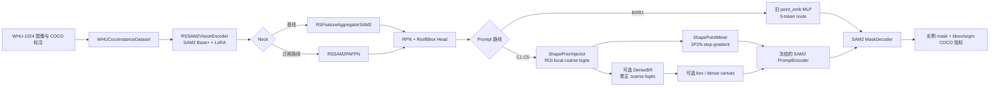

# Portable SAM2 Explicit Coarse：项目架构与文件指南

本文档是新派生项目的结构、接线和使用说明，也是后续代码变更的同步文档。
凡是新增、删除、重命名文件，或改变模型接线、配置参数、训练入口、数据协议、
实验矩阵和验证方式，都应在同一次改动中更新本文档。

## 1. 项目定位与边界

项目根目录：

```text
/home/wangcheng2021/project/portable_sam2_explicit_coarse_new
```

项目包含三个明确隔离的区域：

- `portable_sam2_explicit_coarse/`：唯一的新主线实现和实验入口；
- `sam2/`：随项目固定的官方 SAM2 运行时源码，新主线通过 `SAM2_REPO` 使用；
- `legacy_baseline/`：旧项目冻结复现包，只用于历史基线复现，不被新主线 import。

新主线只保留已经选定的 PAFPN、显式 coarse mask、原生 PromptEncoder 加载和
DenseBR。IIMR、多轮 mask memory、topology token、SABL refined-box 依赖等不属于
新主线。

历史基线与新主线必须使用不同的输出目录，不能覆盖历史 checkpoint。

## 2. 整体架构



### 2.1 两条 Prompt 路线

`prompt_sparse_mode="point"` 是旧基线桥接路线：

- 构造 `point_emb` MLP；
- 不构造 `PromptEncoder`；
- 不构造 `ShapePriorInjector`；
- 不构造 DenseBR。

`prompt_sparse_mode="shape_point"` 是显式 coarse 路线：

- 不构造旧 `point_emb` MLP；
- 由 `ShapePriorInjector` 产生 ROI-local coarse logits；
- 从 coarse logits 挖掘 2 个正点和 2 个负点；
- 按实验配置增加 box token、dense mask prompt 和 DenseBR；
- 使用相同型号 SAM2 checkpoint 加载并冻结原生 PromptEncoder。

### 2.2 coarse 与 DenseBR 接线

- coarse logits 默认大小为 `64×64`，坐标系是 ROI-local；
- 2P2N 挖掘对 coarse logits 使用 stop-gradient；
- dense prompt 会被粘贴到 full-image canvas；1024 输入对应 PromptEncoder 的
  `128×128` mask 输入；
- DenseBR 位于 PromptEncoder 之前，输入和输出都在 ROI-local logit 空间；
- 开启 DenseBR 时，其输出是 coarse loss、2P2N 和 dense canvas 的统一来源；
- 冻结 PromptEncoder 参数时不使用 `torch.no_grad()`，最终 mask loss 仍能回传到
  coarse head 和 DenseBR。

## 3. 顶层目录与文件

| 路径 | 用途 |
|---|---|
| `README.md` | 项目概览、基线复现和新主线快速入口。 |
| `PROJECT_ARCHITECTURE.md` | 本文档；架构、逐文件说明和维护契约的事实来源。 |
| `MIGRATION_MANIFEST.md` | 记录两个参考项目、选取内容、排除内容和复现规则。 |
| `.gitignore` | 顶层 Git 忽略规则。 |
| `scripts/verify_legacy_baseline.sh` | 校验冻结基线文件和 SHA256 完整性。 |
| `scripts/reproduce_legacy_bbox.sh` | 进入冻结包并复现历史 bbox 最强基线。 |
| `scripts/reproduce_legacy_segm.sh` | 进入冻结包并复现历史 segm 最强基线。 |
| `sam2/` | 固定的 SAM2 Python 包及 Hydra 配置；除明确升级 SAM2 外不要修改。 |
| `legacy_baseline/` | 冻结旧项目和完整性清单；不承载新功能。 |
| `portable_sam2_explicit_coarse/` | 新主线源码、配置、训练和消融入口。 |

## 4. 新主线逐文件说明

### 4.1 配置：`portable_sam2_explicit_coarse/configs/`

| 文件 | 用途 |
|---|---|
| `_sam2_registry.py` | 将 SAM2 型号映射到 checkpoint、Hydra YAML 和 neck 通道；解析 `SAM2_MODEL_SIZE`、`SAM2_CKPT`、`SAM2_REPO`。 |
| `rsprompter_anchor_satS_v11_sam2_large_full.py` | 继承自旧项目的完整 MMEngine 基础配置，定义 detector、RPN、RoI head、优化相关默认值。 |
| `whu1024_baseplus_clean.py` | WHU-1024 / SAM2 Base+ 的干净桥接基线；通过 `NECK_TYPE` 切换 aggregator/PAFPN，默认使用旧 MLP prompt 路线。 |
| `whu1024_baseplus_explicit_coarse.py` | 显式 coarse 主配置；通过环境变量选择 points、points+box、points+box+dense 和 DenseBR。 |

配置继承关系：

```text
rsprompter_anchor_satS_v11_sam2_large_full.py
└── whu1024_baseplus_clean.py
    └── whu1024_baseplus_explicit_coarse.py
```

### 4.2 模型：`portable_sam2_explicit_coarse/rsprompter/`

| 文件 | 用途 |
|---|---|
| `__init__.py` | 注册 MMDetection 模型组件；`RSPROMPTER_LIGHT_IMPORT=1` 用于轻量张量测试。 |
| `models.py` | detector、RoI head、bbox head 和旧 SAM/RSPrompter 兼容组件；新主线 proposal prompt 接线也在这里。 |
| `models_sam2.py` | SAM2 主实现：vision encoder、基线 aggregator、PAFPN、MaskDecoder wrapper、MLP/coarse 双路线 MaskHead。 |
| `shape_prior.py` | `ShapePriorInjector`、小型 coarse mask decoder、RoI box encoding 和 `ShapePointMiner`。 |
| `coarse_mask_loss.py` | coarse mask 的 BCE、Dice、boundary、distance 组合损失及权重调度。 |
| `dense_prompt_utils.py` | coarse logit 变换，以及 ROI-local mask 向 full-image PromptEncoder canvas 的粘贴。 |
| `densebr.py` | ROI-local Dense Boundary Refiner；使用图像/ROI/prompt cue 产生受限残差。 |
| `ckpt_utils.py` | SAM2 子模块 checkpoint 的严格加载、key 过滤和主进程日志。 |

关键类的定位：

- `RSSAM2VisionEncoder`：SAM2 Base+ 图像编码器与 LoRA；
- `RSFeatureAggregatorSAM2`：旧 neck 对照；
- `RSSAM2PAFPN`：四层 SAM2 特征的 PAFPN；
- `RSPrompterAnchorMaskHeadSAM2`：决定走 MLP 还是显式 coarse；
- `ShapePriorInjector`：产生 coarse logits；
- `ShapePointMiner`：从 coarse logits 产生 2P2N；
- `DenseBR`：在 PromptEncoder 前细化 coarse logits。

### 4.3 数据：`portable_sam2_explicit_coarse/data/`

| 文件 | 用途 |
|---|---|
| `__init__.py` | 导出 `create_train_loader` 并注册 `AdaptiveResize`。 |
| `loader.py` | 统一构造 train/validation DataLoader；实现独立、确定性的 train/val 子集抽样。 |
| `whu_instance_dataset.py` | 当前 WHU COCO 实例分割数据集实现。 |
| `satellite_dataset.py` | 旧 LabelMe 卫星数据兼容数据集。 |
| `satellite_drone_dataset.py` | 旧卫星/UAV 双流兼容数据集；当前 WHU 主线不使用。 |

WHU 默认路径：

```text
2.1 train/train
2.3 valid/validation
2.4 annotation/annotation/train.json
2.4 annotation/annotation/validation.json
```

`TRAIN_SUBSET_RATIO` 和 `VAL_SUBSET_RATIO` 默认均为 `1.0`。小于 1 时按图像级
确定性抽样；训练使用 `SUBSET_SEED`，验证使用 `SUBSET_SEED + 10000`。

### 4.4 训练：`portable_sam2_explicit_coarse/train/`

| 文件 | 用途 |
|---|---|
| `__init__.py` | 训练包标记。 |
| `train_rsprompter_fusion.py` | DDP 训练主入口；负责配置构建、参数组、EMA、checkpoint、断点恢复、COCO bbox/segm 验证和子集参数。 |

常用 CLI：

- `--config`：MMEngine 配置；
- `--data-root`、`--use-whu-coco`：WHU 数据入口；
- `--train-subset-ratio`、`--val-subset-ratio`：独立子集；
- `--init-from`：只加载模型权重开始新实验；
- `--resume-from`：恢复模型、优化器、epoch 等完整训练状态；
- `--max-train-batches`、`--max-val-batches`：快速 smoke；
- `--shape-prior-lr-mult`、`--densebr-lr-mult`：新模块学习率倍率。

### 4.5 运行脚本：`portable_sam2_explicit_coarse/scripts/`

| 文件 | 用途 |
|---|---|
| `run_whu1024_explicit_coarse_4gpu.sh` | 默认四卡 PAFPN + points+box+dense 主线入口；`DENSEBR_ENABLED=1` 开启 DenseBR。 |
| `smoke_test_components.sh` | 启动轻量组件测试。 |
| `smoke_test_components.py` | 检查 PAFPN、shape prior、2P2N、dense canvas、DenseBR 和梯度契约。 |

`scripts/ablations/`：

| 文件 | 用途 |
|---|---|
| `README.md` | 消融矩阵、子集和 dry-run 用法。 |
| `_run_ablation.sh` | 所有消融共享的受控运行器；固定架构变量、执行契约校验并组装 torchrun。 |
| `validate_ablation_contract.py` | 校验解析后配置、真实数据子集和可选完整模型实例是否与脚本声明一致。 |
| `smoke_all.sh` | 检查全部消融，并对 B0、B1、C1、C5 做代表性完整模型构建。 |
| `b0_aggregator_mlp.sh` | Aggregator + 旧 MLP 基线桥接。 |
| `b1_pafpn_mlp.sh` | 只将 neck 切到 PAFPN。 |
| `c1_aggregator_coarse_points.sh` | Aggregator + coarse 2P2N。 |
| `c2_pafpn_coarse_points.sh` | PAFPN + coarse 2P2N。 |
| `c3_pafpn_coarse_points_box.sh` | C2 + box prompt。 |
| `c4_pafpn_coarse_points_box_dense.sh` | C3 + dense mask prompt。 |
| `c5_pafpn_coarse_densebr.sh` | C4 + DenseBR。 |

### 4.6 工具与通用函数

| 文件 | 用途 |
|---|---|
| `tools/mask_to_coco_whu512.py` | 将 WHU 二值 mask 转为 COCO polygon 标注；属于数据准备工具，不是训练必需步骤。 |
| `utils/__init__.py` | 通用工具包标记。 |
| `utils/coco_eval_utils.py` | 构造 COCO GT/DT 并执行 bbox/segm COCOeval。 |
| `utils/transforms.py` | `AdaptiveResize` MMDetection transform。 |
| `.gitignore` | 忽略本地缓存、运行产物等。 |

### 4.7 运行产物

`portable_sam2_explicit_coarse/logs/` 保存历史运行日志和 `.params` 快照，不是模型
源码。新的 checkpoint 默认写到 `/data/wangcheng/checkpoint/portable_sam2_explicit_coarse/`，
不应提交 checkpoint、临时日志、`__pycache__` 或数据集。

## 5. 常用操作

所有新主线命令从以下目录执行：

```bash
cd /home/wangcheng2021/project/portable_sam2_explicit_coarse_new/portable_sam2_explicit_coarse
```

组件 smoke：

```bash
bash scripts/smoke_test_components.sh
```

消融 smoke，不启动训练：

```bash
# 配置、命令、真实子集和代表性完整模型构建
bash scripts/ablations/smoke_all.sh

# 跳过完整模型构建的快速检查
FULL_MODEL_SMOKE=0 bash scripts/ablations/smoke_all.sh
```

启动完整数据实验：

```bash
bash scripts/ablations/c4_pafpn_coarse_points_box_dense.sh
```

启动快速子集实验：

```bash
TRAIN_SUBSET_RATIO=0.1 \
VAL_SUBSET_RATIO=0.2 \
SUBSET_SEED=44 \
MAX_EPOCHS=10 \
bash scripts/ablations/c5_pafpn_coarse_densebr.sh
```

只解析和核验，不训练：

```bash
DRY_RUN=1 CHECK_DATA=1 PREFLIGHT_MODEL=1 \
bash scripts/ablations/c5_pafpn_coarse_densebr.sh
```

复现冻结历史基线：

```bash
cd /home/wangcheng2021/project/portable_sam2_explicit_coarse_new
bash scripts/verify_legacy_baseline.sh
bash scripts/reproduce_legacy_segm.sh
```

## 6. 主要环境变量

| 变量 | 默认值/含义 |
|---|---|
| `SAM2_REPO` | 项目内 `../sam2`。 |
| `SAM2_CKPT` | `/data/wangcheng/pretrained-models/sam2/sam2_hiera_base_plus.pt`。 |
| `WHU1024_DATA_ROOT` | `/data/wangcheng/dataset/WHU`。 |
| `NECK_TYPE` | `aggregator` 或 `pafpn`；消融 wrapper 会固定。 |
| `EXPLICIT_PROMPT_MODE` | `points`、`points_box` 或 `points_box_dense`。 |
| `DENSEBR_ENABLED` | `0/1`。 |
| `TRAIN_SUBSET_RATIO` | 训练集比例，默认 `1.0`。 |
| `VAL_SUBSET_RATIO` | 验证集比例，默认 `1.0`。 |
| `SUBSET_SEED` | 子集与训练随机种子，默认 `44`。 |
| `MAX_EPOCHS` | 最大 epoch，默认 `80`。 |
| `CHECKPOINT_DIR` | 实验输出目录；消融运行器会按实验和子集自动隔离。 |
| `INIT_FROM` | 初始化 checkpoint。 |
| `RESUME_FROM` | 完整断点恢复 checkpoint。 |
| `CUDA_VISIBLE_DEVICES` | 可见 GPU，默认 `0,1,2,3`。 |
| `NPROC_PER_NODE` | DDP 进程数，默认 `4`。 |

## 7. 修改项目时的文档同步规则

每次变更结束前检查：

1. 新增、删除或重命名文件：更新第 3、4 节的目录和逐文件说明；
2. 修改模型数据流或模块开关：更新第 2 节架构与接线；
3. 修改配置继承或环境变量：更新第 4.1、6 节；
4. 修改数据划分、路径或抽样：更新第 4.3 节；
5. 修改训练 CLI、checkpoint 或评估协议：更新第 4.4、5 节；
6. 新增实验 wrapper：更新消融表、命令示例和 `scripts/ablations/README.md`；
7. 运行与改动风险相称的 smoke，并确保文档描述的是实际解析后的行为；
8. 将本文档与对应代码放进同一个 Git 提交。

如果代码与文档冲突，以经过检查的代码行为为依据修正文档，不要保留未经验证的
计划性描述。

全局 skill 位于
`/home/wangcheng2021/.codex/skills/maintain-explicit-coarse-docs/`。当 Codex
处理本项目的新增或改动时，它负责默认执行上述同步流程。

## 8. 文档同步记录

- 2026-07-28：建立项目架构、逐文件用途、运行入口和文档同步规则；覆盖当前
  PAFPN、MLP/coarse 双路线、PromptEncoder、DenseBR、消融矩阵和数据子集协议。
